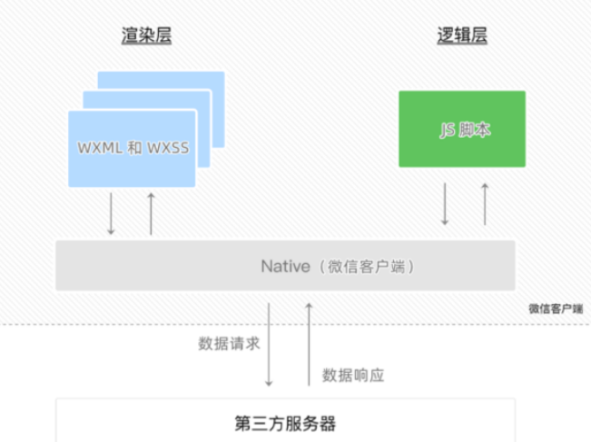

# 小程序

## 基本组成结构

1. `pages` 用来存放所有小程序的页面，每个页面都是一个单独的文件夹
2. `utils` 用来存放工具性质的模块
3.  `app.js` 整个小程序项目的入口文件
4. `app.json` 小程序项目的全局配置文件
5. `app.wxss` 小程序项目的全局样式文件
6. `project.config.json` 项目的配置文件
7. `sitemap.json` 用来配置小程序及其页面是否允许被微信索引

## 页面的组成部分

小程序官方建议把所有小程序的页面，都存放在 pages 目录中，以单独的文件夹存在，如图所示：

1. `.js` 文件
2.  `.json` 文件（当前页面的配置文件，配置窗口的外观、表现等）
3. `.wxml` 文件（页面结构）
4. `.wxss` 文件（页面样式）

## . JSON 配置文件

1. 项目根目录的 `app.json` 配置文件
2. 项目根目录种的 `project.config.json` 配置文件
3. 项目根目录中的 `sitemap.json` 配置文件
4. 每个页面文件夹中的 `.json` 配置文件

### `app.json` 配置文件

`app.json` 是当前小程序的全局配置，包括了小程序的所有页面路径、窗口外观、界面表现、底部 tab 等。Demo 项目里边的 `app.json` 配置内容如下：

```json
{
  "pages": [
    "pages/index/index",
    "pages/logs/logs"
  ],
  "window": {
    "backgroundTextStyle": "light",
    "navigationBarBackgroundColor": "#fff",
    "navigationBarTitleText": "Weixin",
    "navigationBarTextStyle": "black"
  },
  "style": "v2",
  "sitemapLocation": "sitemap.json"
}
```

- pages ：用来记录当前小程序所有页面的路径
- window ：全局定义 小程序所有页面的背景色、文字颜色等
- style ：全局定义小程序组件所使用的样式版本
- `sitemapLocation` ：用来指明 `sitemap.json` 的位置

### `project.config.json` 配置文件

`project.config.json` 是项目配置文件，用来记录我们对小程序开发工具所做的个性化配置

- setting 保存了编译相关的配置
-  `projectname` 保存的是项目名称
-  `appid` 保存的是小程序的账号 ID

这里需要将 `project.config.json` 和 `app.json` 配置文件的作用区分开来,

`project.config.json` 更多的是对微信开发者工具的配置, 而 `app.json` 是对项目代码功能层面上的配置.


### `sitemap.json` 配置文件

- 微信现已开放小程序内搜索，效果类似于 PC 网页的 SEO 。 `sitemap.json` 文件用来配置小程序 页面是否允许微信索引。
- 当开发者允许微信索引时，微信会通过爬虫的形式，为小程序的页面内容建立索引。当用户的搜索 关键字和页面的索引匹配成功的时候，小程序的页面将可能展示在搜索结果中。

> 注意： sitemap 的索引提示是默认开启的，如需要关闭 sitemap 的索引提示，可在小程序项目配置文 件 `project.config.json` 的 setting 中配置字段 `checkSiteMap` 为 false

### 页面的 `.json` 配置文件

小程序中的每一个页面，可以使用 `.json` 文件来对本页面的窗口外观进行配置，页面中的配置项会覆 盖 `app.json` 的 window 中相同的配置项, 当然, 这指的是当前页面被展示出来的时候.

### 新建小程序页面

在 `app.json -> pages` 中新增页面的存放路径，小程序开发中工具就可帮我们自动创建对应的页面文件

### 修改项目首页

只需要调整 `app.json -> pages` 数组中页面路径的前后顺序，即可修改项目的首页。小程序会把排在 第一位的页面，当作项目首页进行渲染。


## .WXML

WXML 是小程序框架的标签语言,用来构建小程序页面的结构，其作用类似于网页开发中的 HTML。他们 主要存在下面几点的差别

1、标签名不同

- HTML（div）
- WXML(view, text, image, navigator)

2、属性节点不同

- ```html
  <a href="#" > </a>
  <navigator url=""></navigator>
  ```

3、提供了类似于 `Vue` 中的模板语法

1. 数据绑定
2. 列表渲染
3. 条件渲染

## .WXSS

WXSS (WeiXin Style Sheets) 是一套样式语言，用于描述 WXML 的组件样式，类似于网页开发中的 CSS 。他们主要存在下面几点的差别

1、新增了 `rpx` 尺寸单位

- CSS 中需要手动进行像素单位换算，例如 rem
- WXSS 在底层支持新的尺寸单位 rpx ，在不同大小的屏幕上小程序会自动进行换算

2、提供了全局的样式和局部样式

- 项目根目录中的 app.wxss 会作用于所有小程序页面
- 局部页面的 .wxss 样式仅对当前页面生效

3、WXSS 仅支持部分 CSS 选择器

- .class 和 #id
- element
- 并集选择器、后代选择器
- ::after 和 ::before 等伪类选择器

## 小程序的宿主环境

- 宿主环境

  宿主环境（host environment）指的是程序运行所必须的依赖环境。例如： Android 系统和 iOS 系统是两个不同的宿主环境。安卓版的微信 App 是不能在 iOS 环境下运行 的，所以， Android 是安卓软件的宿主环境，脱离了宿主环境的软件是没有任何意义的！ 手机微信是小程序的宿主环境，如图所示：

  

  小程序借助宿主环境提供的能力，可以完成许多普通网页无法完成的功能，例如：

  微信扫码、微信支付、微信登录、地理定位、 etc …

  小程序的宿主环境包含以下几部分内容：

  1. 通信模型
  2. 运行机制
  3. 组件
  4. API

### 通信模型

小程序中通信的主体是渲染层和逻辑层，其中：

1. WXML 模板和 WXSS 样式工作在渲染层
2. JS 脚本工作在逻辑层

而所谓的通信模型指的是:

1. 渲染层和逻辑层之间的通信
2. 逻辑层和第三方服务器之间的通信

这两部分的通信都是通过微信客户端进行转发




### 运行机制

小程序的运行机制主要讲两部分

1、小程序启动的过程

1. 把小程序的代码包下载到本地
2. 解析 app.json 全局配置文件
3. 执行 app.js 小程序入口文件，调用 App() 创建小程序实例
4. 渲染小程序首页
5. 小程序启动完成


2、某个页面渲染的过程

1. 加载解析页面的 .json 配置文件
2. 加载页面的 .wxml 模板和 .wxss 样式
3. 执行页面的 .js 文件，调用 Page() 创建页面实例
4. 页面渲染完成

## 4、组件

### 常用的组件

小程序中的组件也是由宿主环境提供的，开发者可以基于组件快速搭建出漂亮的页面结构。官方把小程 序的组件分为了 9 大类，分别是：

1. <strong style="color:red">视图容器</strong>
2. <strong style="color:red">基础内容</strong>
3. <strong style="color:red">表单组件</strong>
4. <strong style="color:red">导航组件</strong>
5. 媒体组件
6. map地图组件
7. canvas画布组件
8. 开放能力
9. 无障碍访问

对于视图容器组件而言, 常用的有以下3个

- <strong style="color:red">view</strong>

  普通视图区域

  类似于 HTML 中的 div，是一个块级元素 

  常用来实现页面的布局效果

- <strong style="color:red">scroll-view</strong>

  可滚动的视图区域 

  常用来实现滚动列表效果

- <strong style="color:red">swiper 和 swiper-item</strong>

  轮播图容器组件 和 轮播图 item 组件

### `view` 组件的使用

flex 横向布局效果

```html
<!--pages/list/list.wxml-->
<view class="container1">
  <view>A</view>
  <view>B</view>
  <view>C</view>
</view>

```

```css
/* pages/list/list.wxss */
.container1 {
  display: flex;
  justify-content: space-around;
  align-items: flex-start;
}

.container1 view {
  width: 100px;
  height: 100px;
  line-height: 100px;
  text-align: center;
  background-color: yellowgreen;
  color: #fff;
}
```


### scroll-view 组件的使用

scroll-view 主要来实现元素内部的滚动, 

注意, 元素内部的滚动和整个页面的滚动不是同一回事. 代码如下:

```html
<!-- 元素滚动 -->
<!-- scorll-y 允许纵向滚动 -->
<!-- scorll-x 允许横向滚动 -->
<scroll-view class="container1" scroll-y>
  <view>A</view>
  <view>B</view>
  <view>C</view>
</scroll-view>
```


```css
/* 元素滚动 */
.container1 {
  /* 给父盒子添加固定高度，内部的元素就可以滚动 */
  width: 100px;
  height: 130px;
}

.container1 view {
  width: 100px;
  height: 100px;
  line-height: 100px;
  text-align: center;
  color: #fff;
}

.container1 view:nth-child(1) {
  background-color: yellowgreen;
}

.container1 view:nth-child(2) {
  background-color: lightskyblue;
}

.container1 view:nth-child(3) {
  background-color: lightcoral;
}
```

### `swiper` 组件的使用

`swiper` 组件相当于一个大盒子, `swiper-item` 指的是轮播图 的每一项

```html
<!-- 轮播图的结构 -->
<swiper class="swiper-container">
  <!-- 第一个轮播图 -->
  <swiper-item>
    <view class="item">A</view>
  </swiper-item>
  <!-- 第一个轮播图 -->
  <swiper-item>
    <view class="item">B</view>
  </swiper-item>
  <!-- 第一个轮播图 -->
  <swiper-item>
    <view class="item">C</view>
  </swiper-item>
</swiper>
```


```css
/* 轮播图样式 */
.swiper-container {
  height: 150px;
}

.item {
  height: 100%;
  line-height: 150px;
  text-align: center;
}

swiper-item:nth-child(1) .item {
  background-color: lightcoral;
}

swiper-item:nth-child(2) .item {
  background-color: lightseagreen;
}

swiper-item:nth-child(3) .item {
  background-color: lightpink;
}

```

`swiper` 还有其他相应的属性, 如下:

1. indicator-dots **是否显示面板指示点**
2. indicator-color 指示点颜色
3. indicator-active-color 激活指示点颜色 
4. `autoplay` **是否自动切换** 
5. interval 自动切换时间间隔 
6. circular **是否采用衔接滑动**


### text 组件和 rich-text 组件

`text` 组件 ---  文本组件

类似于 HTML 中的 span 标签，是一个行内元素

`rich-text` 组件 

**富文本组件** 支持把 HTML 字符串渲染为 WXML 结构

**通过 text 组件的 user-select 属性，实现长按选中文本内容的效果**

> selectable 已弃用，请改用 user-select

```html
<!-- 只有在text组件中添加selectable 属性支持长按选中效果 -->
<view>
  <text user-select>手机号码支持长按选中效果：13333333333</text>
</view>
```

通过 rich-text 组件的 nodes 属性节点，把 HTML 字符串渲染为对应的 UI 结构

```html
<!-- rich-text组件中添加 nodes节点可以把 HTML 字符串渲染为对应的 UI 结构 -->
<rich-text nodes="<h1 style='color: red;'>标题</h1>">
</rich-text>
```

> 注意: 小程序默认是识别不了 HTML 的, 小程序默认只识别 WXML , 所以如果我们从服务器上获取到了包含 HTML 字符串的数据, 并且想展示出来, 应该使用到 rich-text 组件的 nodes 属性

### button 组件

button 是按钮组件,它的功能比 HTML 中的 button 按钮丰富,我们可以通过 **open-type 属性可以调用 微信提供的各种功能**（客服、转发、获取用户授权、获取用户信息等,关于 open-type 的使用在后续的 讲解课程中会用到.

```html
<!-- 通过type属性指定按钮颜色类型 -->
<button>普通按钮</button>
<button type="primary">主色调按钮</button>
<button type="warn">警告按钮</button>
<!-- 通过size属性指定按钮尺寸 -->
<button size="mini">普通按钮</button>
<button size="mini" type="primary">主色调按钮</button>
<button size="mini" type="warn">警告按钮</button>
<!-- 通过plain属性指定按钮的镂空效果 -->
<button plain>普通按钮</button>
<button plain type="primary">主色调按钮</button>
<button plain type="warn">警告按钮</button>
```


### image 组件

image 是图片组件(注意,不是 `img` 哦, 是 image ), 用来展示图片的, 它也是通过 `src` 属性来指明图片的路 径.

image 组件默认宽度约 300px 、高度约 240px

关于 image 组件, 还有一个属性叫做 mode , 它是用来控制图片的裁剪和缩放形式, 具体的可选值如下:

| mode值        | 说明                                                         |
| :------------ | ------------------------------------------------------------ |
| `scaleToFill` | (默认值)缩放模式，不保持纵横比缩放图片，使图片的宽高完全拉伸至填满 image元素 |
| `aspectFit`   | 缩放模式，保持纵横比缩放图片，使图片的长边能完全显示出来可以完整的将 图片显示出来 |
| `aspectFill`  | 缩放模式，保持纵横比缩放图片，只保证图片的短边能完全显示出来图片通常 旨在水平或垂直方向是完整的，另一个方向将发生截取 |
| `widthFix`    | 缩放模式，宽度不变，高度自动变化，保持原图宽高比不变         |
| `heightFix`   | 缩放模式，高度不变，宽度自动变化，保持原图宽高比不变         |


## API 的3大分类

小程序中的 API 是由宿主环境提供的，通过这些丰富的小程序 API ，开发者可以方便的调用微信提供 的能力，

例如：获取用户信息、本地存储、支付功能等。 小程序 API 分为3大类, 分别是:

1、事件监听API

- 特点：以 on 开头，用来监听某些事件的触发
- 举例： `wx.onWindowResize(function callback)` 监听窗口尺寸变化的事件

2、同步API

- 特点1：以 Sync 结尾的 API 都是同步 API
- 特点2：同步 API 的执行结果，可以通过函数返回值直接获取，如果执行出错会抛出异常
- 举例： `wx.setStorageSync('key', 'value')` 向本地存储中写入内容

3、异步API

- 特点：类似于 jQuery 中的 $.ajax(options) 函数，需要通过 success、fail、complete 接收调 用的结果
- 举例： `wx.request()` 发起网络数据请求，通过 success 回调函数接收数据

## 5、协同工作和发布


### 5.1、权限管理

### 5.2、项目成员的组织结构

### 5.3、小程序成员管理

小程序成员管理体现在管理员对小程序项目成员及体验成员的管理：

1、项目成员

- 表示参与小程序开发、运营的成员
- 可登录小程序管理后台
- 管理员可以添加、删除项目成员，并设置项目成员的角色

2、体验成员

- 表示参与小程序内测体验的成员
- 可使用体验版小程序，但不属于项目成员
- 管理员及项目成员均可添加、删除体验成员

### 5.4、不同项目成员对应的权限：

| 权限           | 运营者 | 开发者 | 数据分析者 |
| -------------- | ------ | ------ | ---------- |
| 开发者权限     |        | √      |            |
| 体验者权限     | √      | √      | √          |
| 登录           | √      | √      | √          |
| 数据分析       |        |        | √          |
| 微信支付       | √      |        |            |
| 推广           | √      |        |            |
| 开发管路       | √      |        |            |
| 开发设置       |        | √      |            |
| 暂停服务       | √      |        |            |
| 接触关联公众号 | √      |        |            |
| 腾讯云管理     |        | √      |            |
| 小程序插件     | √      |        |            |
| 游戏运营管理   | √      |        |            |

开发者所具备的权限有: 开发权限, 体验者权限, 登录权限,开发设置,腾讯云管理

- 开发者权限：可使用小程序开发者工具及对小程序的功能进行代码开发
- 体验者权限：可使用体验版小程序
- 登录权限：可登录小程序管理后台，无需管理员确认
- 开发设置：设置小程序服务器域名、消息推送及扫描普通链接二维码打开小程序
- 腾讯云管理：云开发相关设置

### 5.5、运营数据

两种方式

- 在“小程序后台”查看 
  - 登录小程序管理后台 
  - 点击侧边栏的“统计” 
  - 点击相应的 tab 可以看到相关的数据 
- 使用“小程序数据助手”查看 
  - 打开微信 
  - 搜索“小程序数据助手” 
  - 查看已发布的小程序相关的数据


