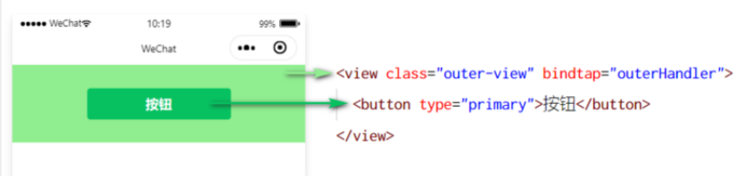
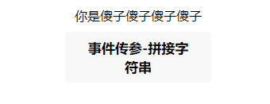
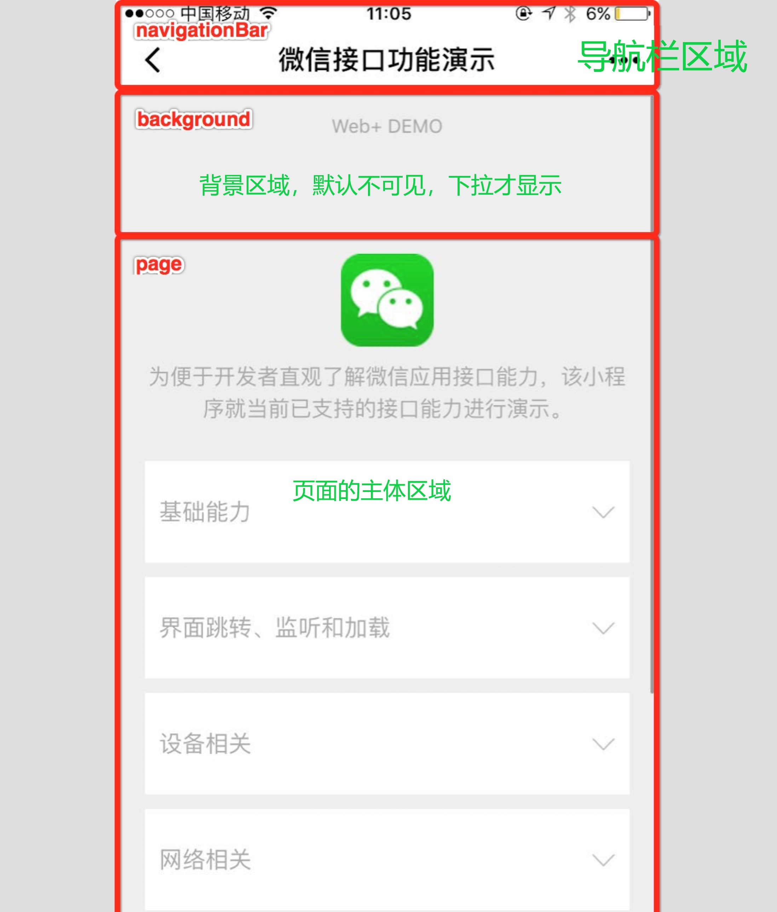
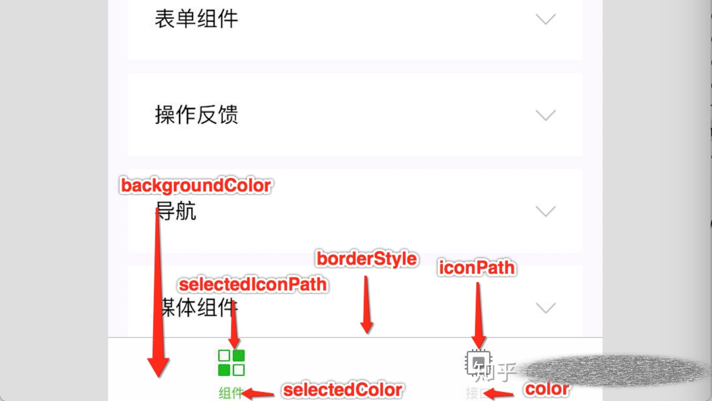

# 小程序-02

## 1、WXML 模板语法

### 1.1、数据绑定

① 在 data 中定义数据 

② 在 WXML 中使用数据

> 1. 在 data 中定义页面的数据

```js
// index.js
// 获取应用实例
const app = getApp()

Page({
  data: {
    motto: 'Hello World',
    userInfo: {},
    hasUserInfo: false,
    canIUse: wx.canIUse('button.open-type.getUserInfo'),
    canIUseGetUserProfile: false,
    canIUseOpenData: wx.canIUse('open-data.type.userAvatarUrl') && wx.canIUse('open-data.type.userNickName') // 如需尝试获取用户信息可改为false
  },
  // 事件处理函数
  bindViewTap() {
    wx.navigateTo({
      url: '../logs/logs'
    })
  },
  onLoad() {
    if (wx.getUserProfile) {
      this.setData({
        canIUseGetUserProfile: true
      })
    }
  },
  getUserProfile(e) {
    // 推荐使用wx.getUserProfile获取用户信息，开发者每次通过该接口获取用户个人信息均需用户确认，开发者妥善保管用户快速填写的头像昵称，避免重复弹窗
    wx.getUserProfile({
      desc: '展示用户信息', // 声明获取用户个人信息后的用途，后续会展示在弹窗中，请谨慎填写
      success: (res) => {
        console.log(res)
        this.setData({
          userInfo: res.userInfo,
          hasUserInfo: true
        })
      }
    })
  },
  getUserInfo(e) {
    // 不推荐使用getUserInfo获取用户信息，预计自2021年4月13日起，getUserInfo将不再弹出弹窗，并直接返回匿名的用户个人信息
    console.log(e)
    this.setData({
      userInfo: e.detail.userInfo,
      hasUserInfo: true
    })
  }
})
```

> 2. 在 WXML 中使用数据

把data中的数据绑定到页面中渲染，使用 Mustache 语法（双大括号）将变量包起来即可。语法格式为

```html
<!-- 插值表达式/大胡子语法 -->
<view>{{ motto }}</view>

<!-- 动态绑定数据 -->
<image src="{{ imgSRC }}" mode="widthFix"></image>

<view>
  {{ randomNum >= 5 ? '数字大于或等于5' : '数字小于5' }}
</view>
```

```js
data: {
    randomNum: Math.random() * 10, // 生成 10 以内的随机数
}
```

::: tip 和 Vue 的差异

在小程序中, 无论是标签的属性还是标签的内容, 都是使用 Mustache 语法进行数据绑定, 这和 Vue 有些差别, 在 Vue 中, 标签的属性是通过 v-bind ,标签的内容是通过 Mustache 语法.

:::

### 1.2、事件绑定

事件是渲染层到逻辑层的通讯方式。通过事件可以将用户在渲染层产生的行为，反馈到逻辑层进行业务 的处理

小程序中常用的事件如下

| 类型   | 绑定方式                  | 事件描述                                         |
| ------ | ------------------------- | ------------------------------------------------ |
| tap    | bindtap 或 bind:tap       | 手指触摸后马上离开，类似于 HTML 中的 click 事 件 |
| input  | bindinput 或 bind:input   | 文本框的输入事件                                 |
| change | bindchange 或 bind:change | 状态改变时触发                                   |

当事件回调触发的时候，会收到一个事件对象 event ，它的详细属性如下表所示：

| 属性           | 类型    | 说明                                         |
| -------------- | ------- | -------------------------------------------- |
| type           | String  | 事件类型                                     |
| timeStamp      | Integer | 页面打开到触发事件所经过的毫秒数             |
| `target`       | Object  | 触发事件的组件的一些属性值集合               |
| currentTarget  | Object  | 当前组件的一些属性值集合                     |
| `detail`       | Object  | 额外的信息                                   |
| touches        | Array   | 触摸事件，当前停留在屏幕中的触摸点信息的数组 |
| changedTouches | Array   | 触摸事件，当前变化的触摸点信息的数组         |

**关注 target 和 detail 这两个属性**

关于 target 属性, 它经常会和 currentTarget 容易混淆

- target 是触发该事件的源头组件，
- currentTarget 则是当前事件所绑定的组件。举例如下：




点击内部的按钮时，点击事件以冒泡的方式向外扩散，也会触发外层 view 的 tap 事件处理函数。 此时，对于外层的 view 来说：

`e.target` 指向的是触发事件的源头组件，因此， e.target 是内部的按钮组件

 `e.currentTarget` 指向的是当前正在触发事件的那个组件，因此， `e.currentTarget` 是当前的 view 组件 所以, 小程序的事件也是具备冒泡的哦

### 1.3、bindtap 的使用 ( onclick)

在小程序中，不存在 HTML 中的 onclick 鼠标点击事件，而是通过 tap 事件来响应用户的触摸行 为。具体步骤如下:

1、通过 bindtap ，可以为组件绑定 tap 触摸事件

```html
<!-- tap触摸事件 -->
<button type="primary" bindtap="onHandleTap">按钮</button>
<!-- +1按钮的事件 -->
<view class="countBox">{{ count }}</view>
<button bindtap="onAddHandle">点我试试</button>

```

事件参数通过形参 event （一般简写成 e ） 来接 收, 

注意,事件处理函数需要和 data 平级

```js
const app = getApp() // 获取应用实例
Page({
  data: {
    randomNum: Math.random() * 10, // 生成 10 以内的随机数
    imgSRC: 'https://timspan.gitee.io/creative_website/assets/dog.e73586b8.jpg',
    userInfo: {},
    count: 1
  },
  onHandleTap: function (e) {
    // 事件对象e
    console.log(e);
  },
  onAddHandle: function () {
    this.setData({
      count: this.data.count + 1
    })
  }
})
```

### 1.4、访问和修改data 中的数据(React)

> 和 react 差不多

### 1.5、事件传参(data-)

**小程序中的事件传参比较特殊**，不能在绑定事件的同时为事件处理函数传递参数。

例如，下面的代码将不能正常工作：

```html
<!-- 错误写法 ，小程序中会将bindtap对应的事件都当做事件名称 -->
<button bindtap="onAddHandle(1, 2)">点我试试</button>
```

因为小程序会把 bindtap 的属性值，统一当作事件名称来处理，相当于要调用一个名称为 btnHandler(123) 的事件处理函数。

我们可以为组件提供 data-* 自定义属性传参，其中 * 代表的是参数的名字，示例代码如下

```html
<view class="countBox">{{ count }}</view>
<!--
事件传参 data-*自定义属性传参，*代表参数名字
info 会被解析为参数的数字
数值2 会被解析为参数的值
-->
<button bindtap="onBtnString" data-info="傻子">事件传参-拼接字符串</button>
```

```js
const app = getApp() // 获取应用实例
Page({
  data: {
    randomNum: Math.random() * 10, // 生成 10 以内的随机数
    imgSRC: 'https://timspan.gitee.io/creative_website/assets/dog.e73586b8.jpg',
    userInfo: {},
    count: '你是'
  },
  // 事件传参-拼接字符串
  onBtnString(e) {
    this.setData({
      // this.data.count就是旧值
      count: this.data.count + e.target.dataset.info
    })
  },

  // onHandleTap: function (e) {
  //   // 事件对象e
  //   console.log(e);
  // },
  // onAddHandle: function () {
  //   this.setData({
  //     count: this.data.count + 1
  //   })
  // }
})
```




### 1.6、bindinput 的使用

在小程序中，通过 input 事件来响应文本框的输入事件，具体的使用步骤如下：

① 通过 bindinput ，可以为文本框绑定输入事件：

```html
<view class="iptBox">
  <!-- input事件 -->
  <input class="ipt1" bindinput="inputValue" focus></input>
</view>
```

② 在页面的 .js 文件中定义事件处理函数：

```js
  inputValue(e) {
    console.log(e);
    console.log(e.detail.value);
  },
```

### 1.7、双向数据绑定(React)

实现步骤： 

① 定义数据 

② 渲染结构, 绑定 data 中的数据 

③ 美化样式

④ 监听 input 事件

```js
data: {
	msg: '请输入...'
}

```

渲染结构：将data中的 msg 绑定到输入框的 value 属性

```html
<view class="iptBox">
  <!-- input事件 -->
  <input value="{{ msg }}" class="ipt1" bindinput="inputHandle"  focus></input>
</view>
```

监听 input 事件:

```js
  // 实现input的数据和data数据同步
  inputHandle(e) {
    this.setData({
      msg: e.detail.value
    })
    console.log(e.detail.value);
  },

```

### 1.8、条件渲染

在小程序中，使用 `wx:if="{{条件}}"` 来判断是否需要渲染该代码块 也可以配合 `wx:elif` 和 `wx:else` 来添加 else 判断：

```html
<view wx:if="{{ type === 1 }}" >男</view>
<view wx:elif="{{ type === 2 }}" >女</view>
<view wx:else>保密</view>
```

结合 使用 wx:if

如果要一次性控制多个组件的展示与隐藏，可以使用一个 标签将多个组件包装起来，并在 标签上使用 wx:if 控制属性，使用block标签进行包裹，只是包裹性值，不会再页面渲染，类似于 template 标签示例如下：

```html
<block wx:if="{{ true }}">
  <view>显示</view>
  <view>多个</view>
  <view>组件</view>
</block>
```

> 注意： 并不是一个组件，它只是一个包裹性质的容器，不会在页面中做任何渲染。

hidden

在小程序中，直接使用 hidden="{{ condition }}" 也能控制元素的显示与隐藏：

```html
<!-- 使用 hidden="{{ condition }}" 也能控制元素的显示与隐藏 -->
<view hidden="{{ flag }}">条件位 true 时，隐藏元素</view>
```

### 1.9、wx:if 与 hidden 的对比

① 运行方式不同

- wx:if 以动态创建和移除元素的方式，控制元素的展示与隐藏
- hidden 以切换样式的方式（ display: none/block; ），控制元素的显示与隐藏

② 使用建议

- 频繁切换时，建议使用 hidden
- 控制条件复杂时，建议使用 wx:if 搭配 wx:elif 、 wx:else 进行展示与隐藏的切换

### 2.0、列表渲染

wx:for 指定数组，进行循环渲染重复的组件结构

```html
<!-- 循环渲染模板语法 -->
<view wx:for="{{ arr1 }}" class="text">
索引是 {{ index }} 当前项是： {{ item }}
</view>
```

默认情况下，当前循环项的索引用 index 表示；当前循环项用 item 表示。

使用 `wx:for-index` **可以指定当前循环项的索引** 使用 `wx:for-item` 可以**指定当前项的变量名**

```html
<!-- 手动指定索引和当前项的变量名 -->
<view wx:for="{{ arr1 }}" class="text" wx:for-index="i" wx:for-item="item">
	索引是 {{ i }} 当前项是： {{ item }}
</view>
```


类似于 Vue 列表渲染中的 **:key** ，小程序在实现列表渲染时，也建议为渲染出来的列表项指定唯 一的 key 值，从而提高渲染的效率，示例代码如下

```html
<!-- 手动指定索引和当前项的变量名 -->
<view wx:key="index" wx:for="{{ arr1 }}" class="text" wx:for-index="i" wx:for-item="item">
  索引是 {{ i }} 当前项是： {{ item }}
</view>
<!-- wx:key 提高渲染效率 -->
<view wx:key="id" wx:for="{{ arr2 }}" class="text1">
  当前项是： {{ item.username }}
</view>
```

## 2、WXSS 模板样式

WXSS ( WeiXin Style Sheets )是一套样式语言，用于美化 WXML 的组件样式，类似于网页开发中的 CSS 。 

WXSS 具有 CSS 大部分特性，同时， WXSS 还对 CSS 进行了扩充以及修改，以适应微信小程序的开 发。 

与 CSS 相比， WXSS 扩展的特性有： 

- rpx 尺寸单位 
- @import 样式导入


### 2.1、rpx

rpx （ responsive pixel ）是微信小程序独有的，用来解决屏适配的尺寸单位。

rpx 的实现原理非常简单：鉴于不同设备屏幕的大小不同，为了实现屏幕的自动适配， rpx 把所有设 备的屏幕，
在宽度上等分为 750 份, 1份就是1 rpx , 所以: 

- 在较小的设备上，1 rpx 所代表的宽度较小 
- 在较大的设备上，1 rpx 所代表的宽度较大


小程序在不同设备上运行的时候，会自动把 rpx 的样式单位换算成对应的像素单位来渲染，从而实现 屏幕适配

rpx 与 px 之间的单位换算：

在 iPhone6 上， CSS 像素屏幕宽度为375 px ，共有 750 个物理像素，等分为 750rpx 。则： 

- 750 rpx = 375 px = 750 物理像素 

- 1 rpx = 0.5 px = 1物理像素

| 设备          | rpx 换算 px (屏幕宽度/750) | px 换算 rpx (750/屏幕宽度) |
| ------------- | -------------------------- | -------------------------- |
| iPhone 5      | 1 rpx = 0.42 px            | 1px = 2.34rpx              |
| iPhone 6      | 1 rpx = 0.5 px             | 1px = 2rpx                 |
| iPhone 6 Plus | 1 rpx = 0.552 px           | 1px = 1.81rpx              |

官方建议：开发微信小程序时，设计师可以用 iPhone6 作为视觉稿的标准。 开发举例：在 iPhone6 上如果要绘制宽 100px ， 高20px 的盒子，换算成 rpx 单位，宽高分别为 200rpx 和 40rpx 。

### 2.2、样式导入

使用 WXSS 提供的 @import 语法，可以导入外联的样式表。 

@import 后跟需要导入的外联样式表的相对路径，用分号 ; 表示语句结束。示例如下：

### 2.3、全局样式和局部样式

> 1. 全局样式

定义在 app.wxss 中的样式为全局样式，作用于每一个页面。

> 2. 局部样式

在页面的 . wxss 文件中定义的样式为局部样式，只作用于当前页面。

注意：

1. 当局部样式和全局样式冲突时，根据 就近原则 ，局部样式会覆盖全局样式
2.  当局部样式的权重大于或等于全局样式的权重时，才会覆盖全局的样式


## 3、全局配置

### 3.1、全局配置文件及常用的配置项

小程序根目录下的 app.json 文件是小程序的全局配置文件。常用的配置项如下：

```json
{
  "pages":[
    "pages/index/index",
    "pages/logs/logs"
  ],
  "window":{
    "backgroundTextStyle":"light",
    "navigationBarBackgroundColor": "#fff",
    "navigationBarTitleText": "Weixin",
    "navigationBarTextStyle":"black"
  },
  "style": "v2",
  "sitemapLocation": "sitemap.json"
}
```

1. pages：当前小程序所有页面的存放路径
2. window：全局设置小程序窗口的外观
3. tabBar：设置小程序底部的 tabBar 效果
4. style：是否启用新版的组件样式

### 3.2、window

小程序窗口的组成部分：

1. `navigationBar`导航栏 - 顶部导航栏区域
2. `background`背景区 - 默认不可见，下拉才显示
3. `page`页面主体区 - 页面主体用来显示 wxml 中的布局

具体示意图如下:



> 2. 了解 window 节点常用的配置项


| 属性                                                         | 类型            | 默认值   | 描述                                                         | 最低版本                                                     |
| :----------------------------------------------------------- | :-------------- | :------- | :----------------------------------------------------------- | :----------------------------------------------------------- |
| <strong style="color:rgb(133, 255, 133);">navigationBarBackgroundColor</strong> | HexColor        | #000000  | 导航栏背景颜色，如 `#000000`                                 |                                                              |
| <strong style="color:rgb(133, 255, 133);">navigationBarTextStyle</strong> | string          | white    | 导航栏标题颜色，仅支持 `black` / `white`                     |                                                              |
| <strong style="color:rgb(133, 255, 133);">navigationBarTitleText</strong> | string          |          | 导航栏标题文字内容                                           |                                                              |
| <strong style="color:red;">navigationStyle</strong>          | string          | default  | 导航栏样式，仅支持以下值： `default` 默认样式 `custom` 自定义导航栏，只保留右上角胶囊按钮。 | iOS/Android 微信客户端 7.0.0，Windows 微信客户端不支持       |
| homeButton                                                   | boolean         | false    | 在非首页、非页面栈最底层页面或非 tabbar 内页面中的导航栏展示 home 键 | 微信客户端 8.0.24                                            |
| <strong style="color:rgb(133, 255, 133);">backgroundColor</strong> | HexColor        | #ffffff  | 窗口的背景色                                                 |                                                              |
| <strong style="color:rgb(133, 255, 133);">backgroundTextStyle</strong> | string          | dark     | 下拉 loading 的样式，仅支持 `dark` / `light`                 |                                                              |
| backgroundColorTop                                           | string          | #ffffff  | 顶部窗口的背景色，仅 iOS 支持                                | 微信客户端 6.5.16                                            |
| <strong style="color:rgb(133, 255, 133);">backgroundColorBottom</strong> | string          | #ffffff  | 底部窗口的背景色，仅 iOS 支持                                | 微信客户端 6.5.16                                            |
| <strong style="color:rgb(133, 255, 133);">enablePullDownRefresh</strong> | boolean         | false    | 是否开启当前页面下拉刷新。 详见 [Page.onPullDownRefresh](https://developers.weixin.qq.com/miniprogram/dev/reference/api/Page.html#onpulldownrefresh) |                                                              |
| onReachBottomDistance                                        | number          | 50       | 页面上拉触底事件触发时距页面底部距离，单位为px。 详见 [Page.onReachBottom](https://developers.weixin.qq.com/miniprogram/dev/reference/api/Page.html#onreachbottom) |                                                              |
| pageOrientation                                              | string          | portrait | 屏幕旋转设置，支持 `auto` / `portrait` / `landscape` 详见 [响应显示区域变化](https://developers.weixin.qq.com/miniprogram/dev/framework/view/resizable.html) | [2.4.0](https://developers.weixin.qq.com/miniprogram/dev/framework/compatibility.html) (auto) / [2.5.0](https://developers.weixin.qq.com/miniprogram/dev/framework/compatibility.html) (landscape) |
| disableScroll                                                | boolean         | false    | 设置为 `true` 则页面整体不能上下滚动。 只在页面配置中有效，无法在 `app.json` 中设置 |                                                              |
| usingComponents                                              | Object          | 否       | 页面[自定义组件](https://developers.weixin.qq.com/miniprogram/dev/framework/custom-component/)配置 | [1.6.3](https://developers.weixin.qq.com/miniprogram/dev/framework/compatibility.html) |
| initialRenderingCache                                        | string          |          | 页面[初始渲染缓存](https://developers.weixin.qq.com/miniprogram/dev/framework/view/initial-rendering-cache.html)配置，支持 `static` / `dynamic` | [2.11.1](https://developers.weixin.qq.com/miniprogram/dev/framework/compatibility.html) |
| style                                                        | string          | default  | 启用新版的组件样式                                           | [2.10.2](https://developers.weixin.qq.com/miniprogram/dev/framework/compatibility.html) |
| singlePage                                                   | Object          | 否       | 单页模式相关配置                                             | [2.12.0](https://developers.weixin.qq.com/miniprogram/dev/framework/compatibility.html) |
| restartStrategy                                              | string          | homePage | 重新启动策略配置                                             | [2.8.0](https://developers.weixin.qq.com/miniprogram/dev/framework/compatibility.html) |
| handleWebviewPreload                                         | string          | static   | 控制[预加载下个页面的时机](https://developers.weixin.qq.com/miniprogram/dev/framework/performance/tips/runtime_nav.html#_2-4-控制预加载下个页面的时机)。支持 `static` / `manual` / `auto` | [2.15.0](https://developers.weixin.qq.com/miniprogram/dev/framework/compatibility.html) |
| visualEffectInBackground                                     | string          | 否       | 切入系统后台时，隐藏页面内容，保护用户隐私。支持 `hidden` / `none`，若对页面单独设置则会覆盖全局的配置，详见 [全局配置](https://developers.weixin.qq.com/miniprogram/dev/reference/configuration/app.html) | [2.15.0](https://developers.weixin.qq.com/miniprogram/dev/framework/compatibility.html) |
| enablePassiveEvent                                           | Object或boolean | 否       | 事件监听是否为 passive，若对页面单独设置则会覆盖全局的配置，详见 [全局配置](https://developers.weixin.qq.com/miniprogram/dev/reference/configuration/app.html) | [2.24.1](https://developers.weixin.qq.com/miniprogram/dev/framework/compatibility.html) |
| renderer                                                     | string          | 否       | 渲染后端                                                     | [2.25.2](https://developers.weixin.qq.com/miniprogram/dev/framework/compatibility.html) |

```json
"window":{
// 下拉loading的样式，仅支持dark/light
"backgroundTextStyle":"light",
// 配置导航栏背景色,仅支持16进制的颜色
"navigationBarBackgroundColor": "#fff",
// 导航栏标题文本
"navigationBarTitleText": "微信读书",
// 导航栏标题颜色，仅支持 black/white
"navigationBarTextStyle":"black",
// 开启下拉刷新
"enablePullDownRefresh": true,
// 下拉窗口的背景色
"backgroundColor": "#efefef",
// 上拉触底的距离：默认50像素，单位省去,我们会在触发了上拉触底事件时获取下一页的数
据
"onReachBottomDistance": 50
},

```

### 3.3、tabBar

- 底部tabBar
- 顶部tabBar

注意：

- tabBar 中只能配置最少 2 个、最多 5 个 tab 页签
- 当渲染顶部 tabBar 时，不显示 icon ，只显示文本

一、tabBar 的 6 个组成部分

1. backgroundColor ： tabBar 的背景色
2. selectedIconPath ：选中时的图片路径
3. borderStyle：tabBar 上边框的颜色
4. iconPath ：未选中时的图片路径
5.  selectedColor：tab 上的文字选中时的颜色
6. color：tab 上文字的默认（未选中）颜色

具体示意图如下:



二、tabBar 节点的配置项

二、每个 tab 项的配置选项

| 属性             | 类型   | 必填 | 描述                                                |
| ---------------- | ------ | ---- | --------------------------------------------------- |
| `pagePath`       | String | `是` | `页面路径，页面必须在pages中预先定义`               |
| `text`           | String | `是` | tab上显示的文字                                     |
| iconPath         | String | 否   | `未选中时`的图标路径：当position为top时，不显示icon |
| selectedIconPath | String | 否   | `选中时`的图标路径：当position为top时，不显示icon   |

::: tip 注意

tabbar路径必须放在数组开始的位置，也就是上面

:::

```json
  "pages": [
    "pages/home/home",
    "pages/message/message",
    "pages/contact/contact",
    "pages/index/index"
  ],
```

> 保存之后就自动在`pages`目录下生成了对应的文件夹

三、配置 tabBar 选项

1. 打开 app.json 配置文件，和 pages 、 window 平级，新增 tabBar 节点
2. tabBar 节点中，新增 list 数组，这个数组中存放的，是每个 tab 项的配置对象
3. 在 list 数组中，新增每一个 tab 项的配置对象。对象中包含的属性如下：
   - pagePath 指定当前 tab 对应的页面路径【必填】
   - text 指定当前 tab 上按钮的文字【必填】
   - iconPath 指定当前 tab 未选中时候的图片路径【可选】
   - selectedIconPath 指定当前 tab 被选中后高亮的图片路径【可选】

代码如下：

```json
{
  "pages": [
    "pages/home/home",
    "pages/message/message",
    "pages/contact/contact",
    "pages/index/index"
  ],
  "window": {
    "backgroundTextStyle": "dark",
    "navigationBarBackgroundColor": "#2b4b6b",
    "navigationBarTitleText": "测试",
    "navigationBarTextStyle": "white",
    "enablePullDownRefresh": true,
    "backgroundColor": "#efefef",
    "onReachBottomDistance": 50
  },
  "style": "v2",
  "sitemapLocation": "sitemap.json",
  "usingComponents": {},
  "tabBar": {
    "list": [{
        "pagePath": "pages/home/home",
        "text": "首页",
        "iconPath": "/images/svg/home1.png",
        "selectedIconPath": "/images/svg/home2.png"
      },
      {
        "pagePath": "pages/message/message",
        "text": "消息",
        "iconPath": "/images/svg/message.png",
        "selectedIconPath": "/images/svg/message-active.png"
      },
      {
        "pagePath": "pages/contact/contact",
        "text": "联系人",
        "iconPath": "/images/svg/contact.png",
        "selectedIconPath": "/images/svg/contact-active.png"
      }
    ]
  }
}
```

::: tip icon格式

仅支持 .png、.jpg、.jpeg 格式

:::

## 4、页面配置

1. 小程序中，每个页面都有自己的 .json 配置文件，用来对当前页面的窗口外观、页面效果等进行配 置。
2. 小程序中， app.json 中的 window 节点，可以全局配置小程序中每个页面的窗口表现。 如果某些小程序页面想要拥有特殊的窗口表现，此时，页面级别的 .json 配置文件就可以实现这种需 求。
3. 注意：当页面配置与全局配置冲突时，根据就近原则，最终的效果以页面配置为准。


## 5、网络数据请求

如何在小程序中发起网络请求？

1. 该请求不能称作ajax请求，但是可以称为网络请求
2. 考虑安全性，微信官方要求域名使用 https协议
3. 配置后台的request的合法域名
4. 小程序中的网络请求不存在跨域的问题

出于安全性方面的考虑，小程序官方对数据接口的请求做出了如下两个限制：

1. 只能请求 HTTPS 类型的接口
2. 必须将接口的域名添加到信任列表中

```
配置步骤：登录微信小程序管理后台 -> 开发 -> 开发设置 -> 服务器域名 -> 修改 request 合法域名
```

注意事项：

1. 域名只支持 https 协议
2. 域名不能使用 IP 地址或 localhost
3. 域名必须经过 ICP 备案
4. 服务器域名一个月内最多可申请 5 次修改


发起 GET 请求：

调用微信小程序提供的 wx.request() 方法，可以发起 GET 数据请求

### 5.1、在页面刚加载时请求数据

在很多情况下，我们需要在页面刚加载的时候，自动请求一些初始化的数据。此时需要在页面的 onLoad 事件中调用获取数据的函数，示例代码如下：

```js
  data: {
    banners: []
  },
  // 生命周期函数--监听页面加载
  onLoad(options) {
    this.getSwiper()
  },
  // 获取轮播图数据
  getSwiper() {
    wx.request({
      url: 'https://autumnfish.cn/banner?type=2',
      method: 'GET',
      success: (res) => {
        console.log(res)
        this.setData({
          banners: this.data.banners = res.data.banners
          // banners: res.data.banners
        })
        console.log(this.data.banners);
      }
    })
  },
```


### 5.2、跳过 request 合法域名校验

如果后端仅仅提供了 http 协议的接口、暂时没有提供 https 协议的接口。

此时为了不耽误开发的进度，我们可以在微信开发者工具中，临时开启「开发环境不校验合法域名、 web-view(业务域名)、 TLS 版本及 HTTPS 证书」选项，跳过 request 合法域名的校验。

> 注意： 跳过 request 合法域名校验的选项，仅限在开发与调试阶段使用！

### 5.3、 关于 跨域 和 Ajax 的说明

跨域问题只存在于基于浏览器的 Web 开发中。由于小程序的宿主环境不是浏览器，而是微信客户端， 所以小 程序中不存在跨域的问题。

Ajax 技术的核心是依赖于浏览器中的 XMLHttpRequest 这个对象，由于小程序的宿主环境是微信客户 端，所 以小程序中不能叫做“发起 Ajax 请求”，而是叫做“发起网络数据请求”。


