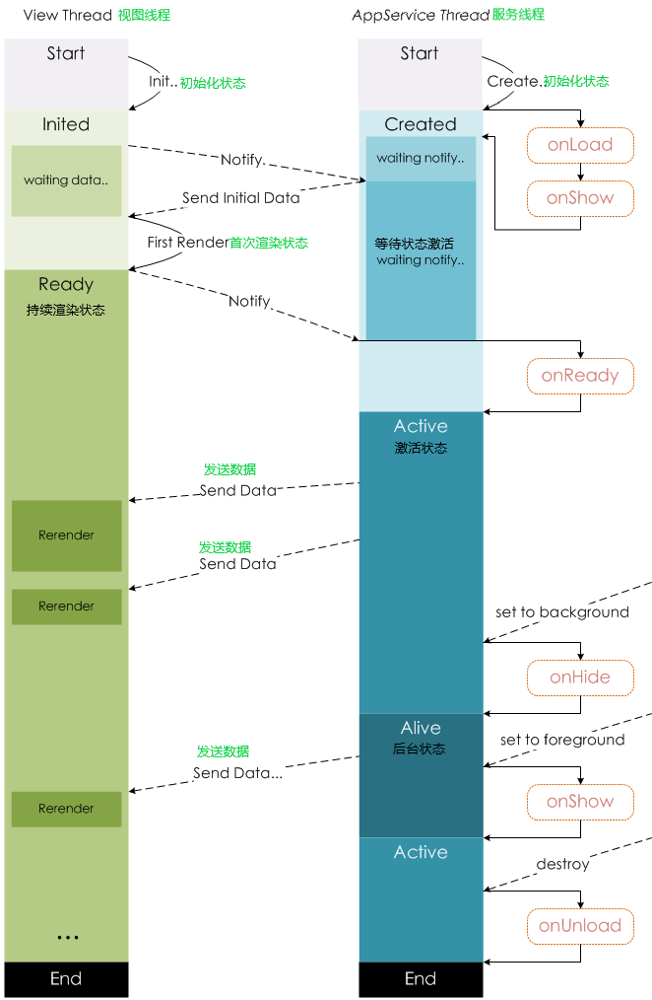
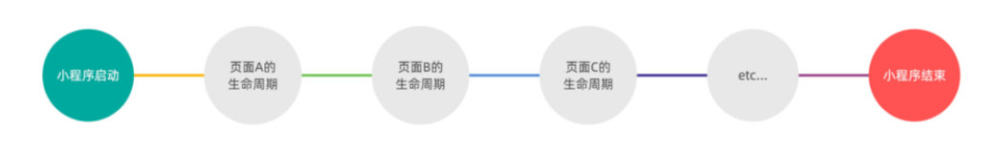

# 小程序-03

## 一、页面导航

一、声明式导航

- 在页面上声明一个 导航组件
- 通过点击 组件实现页面跳转

二、编程式导航

- 调用小程序的导航 API ，实现页面的跳转

### 1.1、声明式导航

#### 1、 导航到 tabBar 页面

tabBar 页面指的是被配置为 tabBar 的页面。 

在使用 组件跳转到指定的 tabBar 页面时，需要指定 url 属性和 open-type 属性，其中： 

- url 表示要跳转的页面的地址，必须以 / 开头 
- open-type 表示跳转的方式，必须为 switchTab 示例代码如下

```html
<!-- 声明式导航 -->
<!--
导航到 tabBar页面的方法：
url必须以“/”根路径开头
并且必须配置open-type属性值为switchTab
-->
<navigator url="/pages/message/message" open-type="switchTab">导航到消息页面
</navigator>
```

#### 2、导航到非 tabBar 页面

非 tabBar 页面指的是没有被配置为 tabBar 的页面。 

在使用 组件跳转到普通的非 tabBar 页面时，则需要指定 url 属性和 open-type 属性，其中： 

- url 表示要跳转的页面的地址，必须以 / 开头 
- open-type 表示跳转的方式，必须为 navigate 
- 为了方便, 非 tabBar 页码的跳转时 open-type 也可以省略 示例代码如下：

```html
<!--
导航到非tabBar页面
也就是没有被配置为tabBar的页面
url必须以“/”根路径开头
如果配置了open-type属性，值为navigate,也可省略不写
-->
<navigator url="/pages/info/info" open-type="navigate">跳转到info页面
</navigator>
<navigator url="/pages/info/info">跳转到info页面</navigator>
```

#### 3、后退导航

如果要后退到上一页面或多级页面，则需要指定 open-type 属性和 delta 属性，其中

- open-type 的值必须是 navigateBack ，表示要进行后退导航
- delta 的值必须是数字，表示要后退的层级

```html
<navigator open-type="navigateBack" delta="1">后退</navigator>
<navigator open-type="navigateBack">后退</navigator>
```

注意：

- 为了简便，如果只是后退到上一页面，则可以省略 delta 属性，因为其默认值就是 1
- tabBar 页面是不能实现后退的效果的. 因为, 当我们跳转到 tabBar 页面，会关闭其他所有非 tabBar 页面,所以当处于 tabBar 页面时, 无页面可退


### 1.2、编程式导航

#### 1、导航到 tabBar 页面

调用 wx.switchTab(Object object) 方法，可以跳转到 tabBar 页面。其中 Object 参数对象的属 性列表如下

参数

Object object

| 属性     | 类型     | 默认值 | 必填 | 说明                                                         |
| :------- | :------- | :----- | :--- | :----------------------------------------------------------- |
| url      | string   |        | 是   | 需要跳转的 tabBar 页面的路径 (代码包路径)（需在 app.json 的 [tabBar](https://developers.weixin.qq.com/miniprogram/dev/reference/configuration/app.html#tabbar) 字段定义的页面），路径后不能带参数。 |
| success  | function |        | 否   | 接口调用成功的回调函数                                       |
| fail     | function |        | 否   | 接口调用失败的回调函数                                       |
| complete | function |        | 否   | 接口调用结束的回调函数（调用成功、失败都会执行）             |


```html
<!--
编程式导航
跳转至tabBar页面
-->
<button bindtap="gotoMessage">跳转到messae页面</button>
```

```js
  // 通过编程式导航
  // 跳转至tabBar页面
  // message页面
  gotoMessage() {
    wx.switchTab({
      // 代表要跳转的路径
      url: '/pages/message/message',
    })
  },
```


#### 2、导航到非 tabBar 页面

调用 wx.navigateTo(Object object) 方法，可以跳转到非 tabBar 的页面。

其中 Object 参数对象的属性列表, 如下：

| 属性     | 类型     | 默认值 | 必填 | 说明                                                         |
| :------- | :------- | :----- | :--- | :----------------------------------------------------------- |
| url      | string   |        | 是   | 需要跳转的应用内非 tabBar 的页面的路径 (代码包路径), 路径后可以带参数。参数与路径之间使用 `?` 分隔，参数键与参数值用 `=` 相连，不同参数用 `&` 分隔；如 'path?key=value&key2=value2' |
| events   | Object   |        | 否   | 页面间通信接口，用于监听被打开页面发送到当前页面的数据。基础库 2.7.3 开始支持。 |
| success  | function |        | 否   | 接口调用成功的回调函数                                       |
| fail     | function |        | 否   | 接口调用失败的回调函数                                       |
| complete | function |        | 否   | 接口调用结束的回调函数（调用成功、失败都会执行）             |

```html
<!--
编程式导航
跳转至非 tabBar页面
-->
<button bindtap="gotoInfo">跳转到Info页面</button>
```

```js
  // 通过编程式导航
  // 跳转至非tabBar页面
  // Info页面
  gotoInfo() {
    wx.navigateTo({
      url: '/pages/info/info',
    })
  },

```

#### 3、后退导航

调用 `wx.navigateBack(Object object)` 方法，可以返回上一页面或多级页面。 其中 Object 参数对象可选的, 属性列表如下：

| 属性     | 类型     | 默认值 | 必填 | 说明                                                    |
| :------- | :------- | :----- | :--- | :------------------------------------------------------ |
| delta    | number   | 1      | 否   | 返回的页面数，如果 delta 大于现有页面数，则返回到首页。 |
| success  | function |        | 否   | 接口调用成功的回调函数                                  |
| fail     | function |        | 否   | 接口调用失败的回调函数                                  |
| complete | function |        | 否   | 接口调用结束的回调函数（调用成功、失败都会执行）        |

```html
<!--
通过编程式导航实现后退导航
-->
<button bindtap="goBack">编程式导航实现后退</button>
```

```js
  goBack() {
    // 如果不传递参数就是返回上一页
    // 如果要传递参数则是传递 delta数字型， 代表返回的层级。
    wx.navigateBack()
  },
```

::: tip 注意

tabBar 页面是不能实现后退的效果的. 因为, 当我们跳转到 tabBar 页面，会关闭其他所有非 tabBar 页面,所以当处于 tabBar 页面时, 无页面可退

:::

### 1.3、导航传参

#### 1、声明式导航传参

navigator 组件的 url 属性用来指定将要跳转到的页面的路径。同时，路径的后面还可以携带参数：

- 参数与路径之间使用 ? 分隔
- 参数键与参数值用 = 相连
- 不同参数用 & 分隔

```html
<!--
声明式导航传参
参数与路径之间使用 ? 分隔
参数键与参数值用 = 相连
不同参数用 & 分隔
-->
<navigator url="/pages/info/info?name=zs&age=20">跳转至info页面</navigator>
```


2、编程式导航传参

调用 `wx.navigateTo(Object object)` 方法跳转页面时，也可以携带参数，代码示例如下

```
<!--
编程式导航传参
-->
<button bindtap="gotoInfo2">跳转到info页面</button>
```

```
  //编程式导航传递参数
  gotoInfo2() {
    wx.navigateTo({
      url: '/pages/info/info?name=李&gender=男',
    })
  },
```

#### 3、在 onLoad 中接收导航参数

通过**声明式导航传参**或**编程式导航传参**所携带的**参数**，可以直接在 `onLoad` 事件中直接获取到，示例代 码如下：

```js
Page({
  data: {
    query: {}, //导航传递的参数
  },
  onLoad: function (options) {
    // 通过声明式导航和编程式导航 
    // 都可以在onLoad声明周期函数中获取传递的参数
    console.log(options);
    // 将导航传递的参数转存在data中
    this.setData({
      query: options
    })
  },
}
```


## 二、页面事件

### 2.1、下拉刷新事件

下拉刷新是移动端的专有名词，指的是通过手指在屏幕上的下拉滑动操作，从而重新加载页面数据的行为。

#### 1、启用下拉刷新有两种方式：

1. 全局开启下拉刷新：在 `app.json` 的 window 节点中，将 `enablePullDownRefresh` 设置为 true
2. 局部开启下拉刷新：在页面的 `.json` 配置文件中，将 `enablePullDownRefresh` 设置为 true

在实际开发中，推荐使用第 2 种方式，为需要的页面单独开启下拉刷新的效果。

#### 2、配置下拉刷新窗口的样式：

在全局或页面的 `.json` 配置文件中，通过 `backgroundColor` 和 `backgroundTextStyle` 来配置下拉 刷新窗口的样式，其中：

- `backgroundColor` 用来配置下拉刷新窗口的背景颜色，仅支持16 进制的颜色值
- `backgroundTextStyle` 用来配置下拉刷新 loading 的样式，仅支持 dark 和 light监听页面的下拉刷新事件

#### 3、监听页面的下拉刷新事件

在页面的 .js 文件中，通过 `onPullDownRefresh()` 函数即可监听当前页面的下拉刷新事件。

例如，在页面的 wxml 中有如下的 UI 结构，点击按钮可以让 count 值自增 +1：

```js
Page({
  data: {
    query: {}, //导航传递的参数
    count: 0,
  },
  addCount() {
    this.setData({
      count: this.data.count + 1
    })
  },
  //页面相关事件处理函数--监听用户下拉动作
  onPullDownRefresh: function () {
    // 触发了下拉刷新事件就会立即调用该方法
    console.log("触发了下拉刷新");
    // 触发了下拉刷洗就将data中的count重置为0
    this.setData({
      count: 0
    })
  },
}
```


#### 4、停止下拉刷新的效果

当处理完下拉刷新后，下拉刷新的 loading 效果会一直显示，不会主动消失，所以需要手动隐藏下拉 刷新的

loading 效果。此时，调用 `wx.stopPullDownRefresh()` 可以停止当前页面的下拉刷新。示例代码如 下：

```js
  //页面相关事件处理函数--监听用户下拉动作
  onPullDownRefresh: function () {
    wx.request({
      url: '',
      method: 'GET',
      success: (res) => {
        this.setData({
          XXX: res.data,
        })
        // 数值处理完毕，就可以关闭下拉刷新的事件了
        wx.stopPullDownRefresh()
      }
    })
  },
```

### 2.2、上拉触底事件

上拉触底是移动端的专有名词，通过手指在屏幕上的上拉滑动操作，从而加载更多数据的行为。

#### 1、. 监听页面的上拉触底事件

在页面的 .js 文件中，通过 `onReachBottom()` 函数即可监听当前页面的上拉触底事件。示例代码如 下：

```js
  //页面上拉触底事件的处理函数
  onReachBottom: function () {
    /*
    上拉触底事件不需要开启，直接监听就可以
    在全局配置的window节点中或者页面的配置文件中可设置触底距离：
    上拉触底的距离：默认50像素，单位省去,我们会在触发了上拉触底事件时获取下一页的数据
    "onReachBottomDistance": 50
    */
    console.log("触发了上拉触底事件");
    /*
    在上拉触底事件中，需要做节流处理
    防止频繁触发该事件导致频繁发起请求
    */
  },
```

#### 3、配置上拉触底距离

上拉触底距离指的是触发上拉触底事件时，滚动条距离页面底部的距离。 

可以在全局或页面的 .json 配置文件中，通过 `onReachBottomDistance` 节点来配置上拉触底的距 离。

小程序默认的触底距离是 50px ，在实际开发中，可以根据自己的需求修改这个默认值。

 **对上拉触底进行节流处理**

1、在 data 中定义 isLoading 节流阀

- false 表示当前没有进行任何数据请求
- true 表示当前正在进行数据请求

```js
/**
* 页面的初始数据
*/
data: {
// 随机颜色数组
colorList: [],
// 节流阀: false代表当前没有进行任何数据请求
isLoading: false
},

```

2、在 getColors() 方法中修改 isloading 节流阀的值

- 在刚调用 getColors 时将节流阀设置 true
- 在网络请求的 complete 回调函数中，将节流阀重置为 false

```js
  getColors() {
    // 1.展示loading效果
    wx.showLoading({
      title: '数据加载中...',
    })
    // 2.开启节流阀
    this.setData({
      isLoading: true
    })
    // 3.发起网络请求
    wx.request({
      url: 'https://www.escook.cn/api/color',
      method: 'GET',
      success: ({
        data: res
      }) => {
        // 修改data中的数据
        this.setData({
          // 使用展开运算符获取到每一个数据，再将数据进行拼接
          colorList: [...this.data.colorList, ...res.data]
        })
      },
      // 无论成功与否都会调用该方法
      complete: () => {
        // 4.隐藏loading效果
        wx.hideLoading()
        // 5.关闭节流阀
        this.setData({
          isLoading: false
        })
      }
    })
  },
```

3、在 onReachBottom 中判断节流阀的值，从而对数据请求进行节流控制

- 如果节流阀的值为 true ，则阻止当前请求
- 如果节流阀的值为 false ，则发起数据请求

```js
/**
* 页面上拉触底事件的处理函数
*/
onReachBottom: function () {
if (this.data.isLoading) return
this.getColors()
},

```

## 三、生命周期

### 3.1、小程序生命周期的分类

1. 应用生命周期 ：特指小程序从启动 -> 运行 -> 销毁的过程
2. 页面生命周期 ： 特指小程序中，每个页面的加载 -> 渲染 -> 销毁的过程

其中，页面的生命周期范围较小，应用程序的生命周期范围较大，如图所示：

页面生命周期：





小程序启动  >   页面A的生命周期   >   页面B的生命周期   >     页面C的生命周期  >   etc..   >    小程序结束


### 3.2、应用的生命周期函数

小程序的应用生命周期函数需要在 app.js 中进行声明，示例代码如下：

```js
// app.js
App({
  /**
   * 当小程序初始化完成时，会触发 onLaunch（全局只触发一次）
   */
  onLaunch: function () {
    console.log("onLaunch")
  },
  /**
   * 当小程序启动，或从后台进入前台显示，会触发 onShow
   * 前台：手机打开该小程序就处于前台运行
   * 后台：手机回到主页，且未关闭小程序，此时小程序就处于后台运行
   */
  onShow: function (options) {
    console.log("onShow")
  },
  /**
   * 当小程序从前台进入后台，会触发 onHide
   */
  onHide: function () {
    console.log("onHide")
  },

})
```


3.3、页面的生命周期函数

小程序的页面生命周期函数需要在页面的 .js 文件中进行声明，示例代码如下：

```js
/**
* 生命周期函数--监听页面加载,一个页面只调用一次
*/
onLoad: function (options) {
},
/**
* 生命周期函数--监听页面初次渲染完成，一个页面只调用一次
*/
onReady: function () {
},
/**
* 生命周期函数--监听页面显示
*/
onShow: function () {
},
/**
* 生命周期函数--监听页面隐藏
*/
onHide: function () {
},
/**
* 生命周期函数--监听页面卸载，一个页面只调用一次
*/
onUnload: function () {
},

```


## 四、WXS 脚本

WXS （ WeiXin Script ）是小程序独有的一套脚本语言，结合 WXML ，可以构建出页面的结构。

wxml 中无法调用在页面的 .js 中定义的函数（不包括事件绑定），但是， wxml 中可以调用 wxs 中 定义的函数。因此，小程序中 wxs 的典型应用场景就是“`过滤器`”。

wxs 和 JavaScript 的关系：

虽然 wxs 的语法类似于 JavaScript ，但是 wxs 和 JavaScript 是完全不同的两种语言：

1. wxs 有自己的数据类型：number 数值类型、 string 字符串类型、 boolean 布尔类型、 object 对象类型、 function 函数类型、 array 数组类型、 date 日期类型、 regexp 正则
2. wxs 不支持类似于 ES6 及以上的语法形式：不支持： let 、 const 、解构赋值、展开运算符、箭头函数、对象属性简写、etc... 支持： var 定义变量、普通 function 函数等类似于 ES5 的语法
3. wxs 遵循 CommonJS 规范：module 对象 require() 函数 module.exports 对象

### 4.1、WXS基础语法

#### 1、内嵌`wxs`脚本

wxs 代码可以编写在 wxml 文件中的 标签内，就像 Javascript 代码可以编写在 html 文件中的 标 签内一样。

wxml 文件中的每个 标签，必须提供 module 属性，用来指定当前 wxs 的模块名称，方便在wxml 中访问模块中的成员：

```html
<!-- 定义一个文本，调用wxs中的方法 -->
<view>{{ m1.toUpper(username) }}</view>
<!-- 定义一个wxs的标签，并指定module模块名称 -->
<wxs module="m1">
  // 向外暴露一个方法
  module.exports.toUpper = function (str) {
    return str.toUpperCase()
  }
</wxs>
```

2、外联的 `wxs` 脚本

wxs 代码还可以编写在以 .wxs 为后缀名的文件内，就像 Javascript 代码可以编写在以 .js 为后 缀名的文件中一样。示例代码如下：

```js
// tools.wxs
// 1.定义方法
function toLower(str) {
	return str.toLowerCase()
}
// 2.暴露成员
module.exports = {
	toLower: toLower
}
```

在 wxml 中引入外联的 wxs 脚本时，必须为 标签添加 module 和 src 属性，其中：

1. module 用来指定模块的名称 
2. src 用来指定要引入的脚本的路径，且必须是相对路径

```html
<!-- 1.使用外联式引入外部的wxs文件 -->
<wxs module="m2" src="../../utils/tools.wxs"></wxs>
<!-- 2.调用 m2 模块的方法 -->
<view>{{ m2.toLower('country') }}</view>
```

#### 2、WXS 的特点

为了降低 wxs （ WeiXin Script ）的学习成本， wxs 语言在设计时借大量鉴了 JavaScript 的语 法。但是本质上， wxs 和 JavaScript 是完全不同的两种语言！

不能作为组件的事件回调

wxs 典型的应用场景就是“过滤器”，经常配合 Mustache 语法进行使用，例如：

隔离性：

隔离性指的是 wxs 的运行环境和其他 JavaScript 代码是隔离的。体现在如下两方面

1.  wxs 不能调用 js 中定义的函数
2. wxs 不能调用小程序提供的 API

性能好

- 在 iOS 设备上，小程序内的 WXS 会比 JavaScript 代码快 2 ~ 20 倍
- 在 Android 设备上，二者的运行效率无差异


