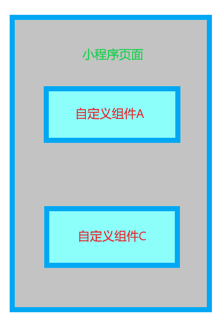
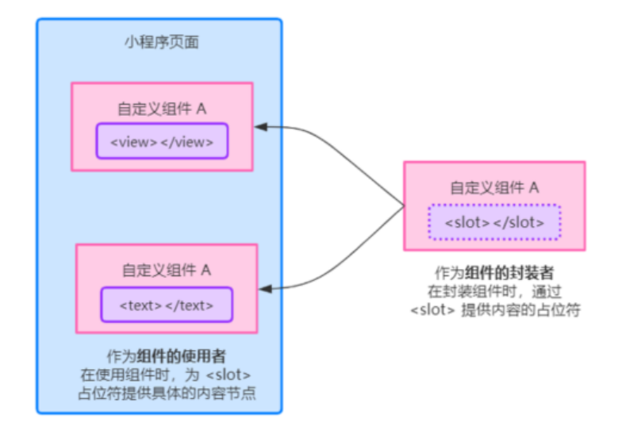

# 小程序-04-自定义组件

## 1、自定义组件 - 组件的创建和引用

### 1.1、创建组件

文件夹 点击 新建Component

键入组件的名称之后回车，会自动生成组件对应的 4 个文件，后缀名分别为 .js ， .json ， .wxml 和 .wxss

::: tip 注意

为了保证目录结构的清晰，建议把不同的组件，存放到单独目录中.

:::


### 1.2.、引用组件的方式

组件的引用方式分为“局部引用”和“全局引用”，顾名思义：

- 局部引用：组件只能在当前被引用的页面内使用
- 全局引用：组件可以在每个小程序页面中使用

在页面的 .json 配置文件中引用组件的方式，叫做“局部引用”。示例代码如下：

### 1.3、局部引用组件

在页面的 .json 配置文件中引用组件的方式，叫做“局部引用”。示例代码如下：

```js
{
	"usingComponents": {
		"my-test1": "/components/test/test"
	}
}
```

其中 my-test1 就是组件使用时的`标签名`, 而 /components/test/test 就是`组件的路径`

### 1.4、全局引用组件

在 app.json 全局配置文件中引用组件的方式，叫做“全局引用”。示例代码如下：

```js
"usingComponents": {
	"my-test2": "/components/test2/test2"
}
```

### 1.5、 全局引用 VS 局部引用

根据组件的使用频率和范围，来选择合适的引用方式： 

- 如果某组件在多个页面中经常被用到，建议进行“全局引用” 
- 如果某组件只在特定的页面中被用到，建议进行“局部引用”

### 1.6.、组件和页面的区别

从表面来看，组件和页面都是由 .js 、 .json 、 .wxml 和 .wxss 这四个文件组成的。但是，组件和 页面的 .js 与 .json 文件有明显的不同：

- 组件的 .json 文件中需要声明 "component": true 属性
- 组件的 .js 文件中调用的是 Component() 函数
  - 整个程序启动调用的是 App()
  - 某个页面的渲染调用的是 Page()
  - 某个组件的渲染调用的是 Component()

::: tip 注意

组件的事件处理函数需要定义到 methods 节点中

:::


## 2、自定义组件 - 样式 

### 2.1、组件样式隔离

默认情况下，自定义组件的样式只对当前组件生效，不会影响到组件之外的 UI 结构，如图所示：



- 组件 A 的样式不会影响组件 C 的样式
- 组件 A 的样式不会影响小程序页面的样式
- 小程序页面的样式不会影响组件 A 和 C 的样式

组件样式的隔离性的好处有：

1. 防止外界的样式影响组件内部的样式
2. 防止组件的样式破坏外界的样式

### 2.2、组件样式隔离的注意点

::: tip 注意点

- `app.wxss` 中的全局样式对组件无效
- 只有 class 选择器会有样式隔离效果， id 选择器、属性选择器、标签选择器不受样式隔离的影 响

建议：在组件和引用组件的页面中建议使用 class 选择器，

不要使用 id、属性、标签选择器！

因为在绝 大多数情况下, 我们希望组件的样式是隔离开的

:::

### 2.3、修改组件的样式隔离选项

默认情况下，自定义组件的样式隔离特性能够防止组件内外样式互相干扰的问题。 

但有时，我们希望在外界能够控制组件内部的样式，此时，可以通过 `styleIsolation` 修改组件的样 式隔离选项，用法如下：

```js
Component({
	options: {
		// 默认值isolated: 代表启动样式隔离
		// apply-shared: 代表页面wxss样式将影响自定义组件
		// shared: 代表双向的影响
		styleIsolation: 'apply-shared'
	}
})
// 或在组件的.json 文件中新增加如下配置
// {
// 	"styleIsolation": "isolated"
// }
```

### 2.4.、`styleIsolation` 的可选值

|              |      |                                                              |
| ------------ | ---- | ------------------------------------------------------------ |
| isolated     | 是   | 表示启用样式隔离，在自定义组件内外，使用 class 指定的样式将不会相互影响 |
| apply-shared | 否   | 表示页面 wxss 样式将影响到自定义组件，但自定义组件 wxss 中指定的样式不会影响页面 |
| shared       | 否   | 表示页面 wxss 样式将影响到自定义组件，自定义组件 wxss 中指定的样式也会影响页面和其他设置了 `apply-shared` 或 `shared` 的自定义组件 |


## 3、自定义组件 - 数据、方法、属性 

### 3.1、data数据

在小程序组件中，用于组件模板渲染的私有数据，需要定义到 data 节点中，

### 3.2、methods方法

在小程序组件中，事件处理函数和自定义方法需要定义到 methods 节点中

### 3.3、properties 属性

在小程序组件中， properties 是组件的对外属性，**用来接收外界(父组件)传递到组件中的数据**，示例 代码如下

```js
  // 属性定义
  properties: {
    // 完整定义 属性的方式【当需要指定属性默认值时，建议使用此方式】
    max: {
      // 属性值的数据类型
      type: Number,
      // 属性值的默认值
      value: 10
    },
    // 简化定义 属性的方式
    max: Number
  },
```

### 3.4、data 和 properties 的区别

在小程序的组件中， properties 属性和 data 数据的用法相同，它们都是可读可写的，只不过：

- data 更倾向于存储组件的私有数据
- properties 更倾向于存储外界传递到组件中的数据
  1. 所以, 也不太建议修改 properties 数据
  2. 如果要修改 properties 的数据, 最好通过子组件通信给父组件的方式实现

### 3.5、修改 properties 的值

由于 data 数据和 properties 属性在本质上没有任何区别，因此 properties 属性的值也可以用于 页面渲染，或使用 setData 为 properties 中的属性重新赋值，示例代码如下：


```js
  Component({
    properties: {
      max: Number
    },
    methods: {
      addCount() {
        // 使用 setData 修改属性的值
        this.setData({
          max: this.properties.max + 1
        })
      }
    }
  })
```


## 4、自定义组件 - 数据监听器 

数据监听器用于监听和响应任何属性和数据字段的变化，从而执行特定的操作。 它的作用`类似于vue中的watch侦听器`。 在小程序组件中,数据监听器的基本语法格式如下：

```js
  Components({
    // observers: 观察者
    observers: {
    '字段A， 字段B': function(字段A的新值， 字段B的新值) {
    // do something
    }
  })
```

监听对象属性的变化:

数据监听器支持监听对象中单个或多个属性的变化，示例语法如下：

方式1: 普通方式

```js
Components({
  // observers: 观察者
  observers: {
    '对象.属性A， 对象.属性B': function (属性A的新值， 属性B的新值) {
      // 触发此侦听器的 3 种情况：
      // 【为属性A赋值】：使用setData 设置this.data.对象.属性A 时触发
      // 【为属性B赋值】：使用setData 设置this.data.对象.属性B 时触发
      // 【为对象赋值】：使用setData 设置this.data.对象 时触发
    }
  }
})
```

方式2: 通配符方式, 监听对象中所有属性的变化

```js
  observers: {
    '_rgb.**': function (obj) {
      this.setData({
        fullColor: `${obj.r}, ${obj.g}, ${obj.b}`
      })
    }
  }

```


## 5、自定义组件 - 纯数据字段 


**概念**：纯数据字段指的是那些不用于界面渲染的 data 字段。

应用场景：

例如有些情况下，某些 data 中的字段**既不会展示在界面上**，**也不会传递给其他组件**，**仅仅在当前组件内部使用**。带有这种特性的 data 字段适合被设置为**纯数据字段**。例如之前控制上拉加载更多的节 流阀 isLoading 这种类型的数据.

使用纯数据的好处:纯数据字段有助于**提升页面更新的性能**。

因为在小程序中， data 中声明的数据，会具备一个响应式的效果，系统的底层会对数据进行值变化的 监听，如果，该数据只是纯数据，没有必要进行响应式的监听，因此定义为纯数据能够提高页面的性能

2、使用规则

在 Component 构造器的 options 节点中，指定 pureDataPattern 为一个 正则表达式 ，字段名符合 这个正则

表达式的字段将会被视为纯数据字段，示例代码如下：

```js
Component({
  options: {
    // 指定所有_开头的数据字段为 纯数据字段
    pureDataPattern: /^_/
  },
  data: {
    a: true, // 普通数据字段
    _b: true // 纯数据字段
  }
})
```

3、使用纯数据字段改造数据监听器案例

```js
Component({
  options: {
    // 指定所有_开头的数据字段为 纯数据字段
    pureDataPattern: /^_/
  },
  data: {
    // 将 rgb 改造为以 _开头的字段
    _rgb: {
      r: 0,
      g: 0,
      b: 0
    },
    fullColor: '0, 0, 0'
  }
})
```


## 6、自定义组件 - 组件的生命周期 

小程序组件可用的全部生命周期如下表所示：

| 声明周期函数 | 参数         | 描述说明                                 |
| ------------ | ------------ | ---------------------------------------- |
| `created`    | 无           | `在组件实例刚刚被创建时执行`             |
| `attached`   | 无           | `在组件实例进入页面节点数时执行`         |
| ready        | 无           | 在组件在视图层布局完成后执行             |
| moved        | 无           | 在组件实例被移动到节点数另一个位置时执行 |
| `detached`   | 无           | `在组件实例从页面节点树移除时执行`       |
| error        | Object Error | 每当组件方法抛出错误时执行               |

### 6.1、组件主要的生命周期函数

在小程序组件中，最重要的生命周期函数是 created 、 attached 、 ready 、 detached 。它们各自的 特点

① 组件实例刚被创建好的时候， created 生命周期函数会被触发 

- 此时调用 setData 不会有效果 
- 通常在这个生命周期函数中，只应该用于给组件的 this 添加一些自定义的属性字段 

② 在组件完全初始化完毕、进入页面节点树后， attached 生命周期函数会被触发 

- 此时， this.data 已被初始化完毕 
- 这个生命周期很有用，绝大多数初始化的工作可以在这个时机进行（例如发请求获取初始数据） 

③ 在组件离开页面节点树后， detached 生命周期函数会被触发 

- 退出一个页面时，会触发页面内每个自定义组件的 detached 生命周期函数 
- 此时适合做一些清理性质的工作,例如,清除定时器 

④ 代表组件渲染完成的生命周期函数为 ready 

- 可以操作页面

### 6.2、lifetimes节点

在小程序组件中，生命周期函数可以直接定义在 Component 构造器的第一级参数中，也可以在 lifetimes 字段内进行声明（这是推荐的方式，其优先级最高）。示例代码如下：

```js
Component({
  // 推荐用法
  lifetimes: {
    attached() {}, // 在组件实例进入页面节点树时执行
    detached() {}, // 在组建实例被从页面节点树移除时执行
  }
})
```

### 6.3、组件所在页面的生命周期

什么是组件所在页面的生命周期？

有时，**自定义组件的行为依赖于页面状态的变化**，此时就需要用到组件所在页面的生命周期。

例如：每当触发页面的 show 生命周期函数的时候，我们希望能够重新生成一个随机的 RGB 颜色值。 在自定义组件中，组件所在页面的生命周期函数有如下 3 个，分别是：

| 生命周期函数 | 参数        | 描述                           |
| ------------ | ----------- | ------------------------------ |
| show         | 无          | 组件所在的页面被`展示`时执行   |
| hide         | 无          | 组件所在的页面被`隐藏`时执行   |
| resize       | Object Size | 组件所在的`页面尺寸变化`时执行 |

所以组件所在页面的生命周期, 相当于在组件中, 监听了组件所在页面的一些事件.

6.4、pageLifetimes 节点

组件所在页面的生命周期函数，需要定义在 pageLifetimes 节点中，示例代码如下：

```js
Component({
  // 组件在页面的生命周期函数在该节点定义
  pageLifetimes: {
    show() {}, // 页面被展示
    hide() {}, // 页面被隐藏
    resize() {} // 页面尺寸变化
  }
})
```

我们可以利用组件所在页面的生命周期, 在页面每次被展示的时候, 随机生成 RGB 颜色值

```js
Component({
  // 组件在页面的生命周期函数在该节点定义
  pageLifetimes: {
    // 组件所在的页面被展示时，随机生成一个颜色值
    show() {
      this.setData({
        _rgb: {
          r: Math.floor(Math.random() * 256),
          g: Math.floor(Math.random() * 256),
          b: Math.floor(Math.random() * 256),
        }
      })
    },
    hide() {}, // 页面被隐藏
    resize() {} // 页面尺寸变化
  }
})
```

或者这样,逻辑更清晰

```js
Component({
  // 在组件的methods节点中，定义一个随机颜色的方法
  methods: {
    _randomColor() {
      // 设置data中的数据
      this.setData({
        _rgb: {
          r: Math.floor(Math.random() * 256),
          g: Math.floor(Math.random() * 256),
          b: Math.floor(Math.random() * 256),
        }
      })
    }
  },
  // 在组件内部的pageLifetimes节点中，监听组件在页面的生命周期函数
  pageLifetimes: {
    // 在页面被展示的时候，调用该方法
    show() {
      this._randomColor()
    },
    hide() {}, // 页面被隐藏
    resize() {} // 页面尺寸变化
  }
})
```


## 7、自定义组件 - 插槽 

在自定义组件的 wxml 结构中，可以提供一个 节点（插槽），用于承载组件使用者提供的 wxml 结构。



其实插槽, 说的通俗一些, 就是子组件挖坑，父组件填坑的过程。由父组件在使用子组件的时候, 决定子 组件内部的某一些布局展示

- 子组件通过 挖坑 
- 父组件通过组件标签中间的内容来填坑

### 7.2、单个插槽

在小程序中，默认每个自定义组件中只允许使用一个 进行占位，这种个数上的限制叫做单个插槽。 

自定义组件的布局代码

```html
<!-- 组件的封装者 -->
<view class="wrapper">
	<view>这里是组件的内部节点</view>
	<!-- 对于不确定的内容，可以使用<slot> 进行占位， 具体内容由组件的使用者决定 -->
	<slot></slot>
</view>
```

```html
<!-- 组件的使用者 -->
<component-tag-name>
	<!-- 这部分内容将被放置在组件的 <slot>的位置上 -->
	<view>这里是插入到组件slot中的内容</view>
</component-tag-name>
```

### 7.3、启用多个插槽

在小程序的自定义组件中，需要使用多 插槽时，可以在组件的 .js 文件中，通过如下方式进行启用。 示例代码如下：**开启多个插槽的配置**

```js
Component({
  options: {
    multipleSolts: true // 在组件定义时的选项中启用多 slot支持
  },
  properties: {
    /* ...*/ },
  methods: {
    /* ...*/ }
})
```

一旦开启了多个插槽的配置, 就意味着在组件内部可能会有多个标签, 那我们在定义这多个标签的时候, 需要给每一个起名字. 

而组件使用者在填充的时候, 需要指明填充哪一个

### 7.4、定义 多个插槽

可以在组件的 .wxml 中使用多个 标签，以不同的 name 来区分不同的插槽。示例代码如下：

```html
<view class="wrapper">
	<!-- name 为 before 的第一个 插槽 -->
	<slot name="before"></slot>
	<view>这是一段固定的文本内容</view>
	<!-- name 为 after 的第一个 插槽 -->
	<slot name="after"></slot>
</view>
```

在使用带有多个插槽的自定义组件时，需要用 slot 属性来将节点插入到不同的 中。示例代码如下：

```html
<!-- 组件的使用者 -->
<component-tag-name>
	<!-- 这部分内容将被放置在组件的 <slot>的位置上 -->
	<view slot="before">这是通过插槽填充的内容,name为before</view>
	<view slot="after">这是通过插槽填充的内容,name为after</view>
</component-tag-name>
```


## 8、自定义组件 - 父子组件通信 

### 8.1、父子组件之间通信的 3 种方式

① 属性绑定 

- 用于父组件向子组件的指定属性设置数据，仅能设置 JSON 兼容的数据(只能传递数据，不能传递 方法) 

② 事件绑定 

- 用于子组件向父组件传递数据，可以传递任意数据(包括数据和方法) 

③ 获取组件实例 

- 父组件还可以通过 `this.selectComponent()` 获取子组件实例对象 
- 这样就可以直接访问子组件的任意数据和方法


### 8.2.、属性绑定

属性绑定用于实现父向子传值，而且只能传递普通类型的数据，无法将方法传递给子组件

```html
data: {
// 父组件中的data节点
	count: 0
}
// 父组件的wxml结构
<my-test3 count="{{count}}"></my-test3>
<view>------</view>
<view>父组件中，count值为 {{count}}</view>
```

子组件在 properties 节点中声明对应的属性并使用。示例代码如下：

```html
// 子组件的properties 节点
properties: {
	count: Number
}
// 子组件的wxml结构
<text>子组件中， count值为：{{count}}</text>
```

### 8.3、事件绑定

事件绑定用于实现子向父传值，可以传递任何类型的数据。使用步骤如下： 

① 在子组件的 js 中，在特定的时机通过调用 this.triggerEvent ('自定义事件名称', { /* 参数对象 */ })产生一个自定义事件, 并且可以带上事件参数对象. 

② 在父组件的 wxml 中的子组件标签中，使用 bind :自定义事件名称="事件处理函数"监听自定义事 件。 

③ 在父组件的 js 中，定义一个函数，这个函数即将通过自定义事件的形式，传递给子组件 

④ 在父组件的 事件处理函数中，通过 e.detail 获取到子组件传递过来的数据

具体的代码如下: 

> 步骤1：在子组件的 js 中，在特定的时机通过调用 this.triggerEvent 产生一个自定义事件

```html
// 子组件中的 wxml结构
<text>子组件中，count值为: {{count}}</text>
<button bindtap="addCount">+1</button>

```

```js
  // 子组件中的js代码
  methods: {
    addCount() {
      // this.setData这行代码写的很多此一举
      // 因为只要父组件修改了它传递到子组件的数据, 子组件自然就随之进行更新了
      this.setData({
        count: this.properties.count + 1
      })
      // 使用 this.triggerEvent去触发父组件的自定义事件
      // 并将数值同步给父组件
      this.tiggerEvent('sync', {
        value: this.properties.count
      })
    }
  }
```

步骤2：在父组件的 wxml 中的子组件标签中，使用 bind :自定义事件名称=“事件处理函数”监听 自定义事件

```html
<my-test3 count="{{count}}" bind:sync="syncCount"></my-test3>

```

步骤3：在父组件的 js 中，定义一个函数，这个函数在自定义事件产生的时候, 会得到执行

```js
// 在父组件的JS文件中，定义一个事件
syncCount (e) {
	console.log(e)
}
```

步骤4：在父组件的 js 中，通过 e.detail 获取到子组件传递过来的数据。

```js
// 父组件的js文件
syncCount (e) {
	this.setData({
// 父组件通过事件对象 e 获取到子组件传递的值
		count: e.detail.value
	})
}
```

### 8.4、获取组件实例

可在父组件里调用 this.selectComponent("id或class选择器") ，获取子组件的实例对象，从而直 接访问子组件的任意数据和方法。调用时需要传入一个选择器，例如 this.selectComponent(".mycomponent") 。

```html
<!--
父组件的wxml文件
使用 bind:自定义事件名称（推荐: 结构清晰
-->
<my-test class="cusstomA" id="cA" count="{{count}}" bind:sync="syncCount">
</my-test>
<button bindtap="getChild">获取子组件实例</button>
```

```js
    //父组件的js文件 按钮的tap事件处理函数
    getChild() {
      // 切记下面的参数不能传递标签选择器，不然返回的是null
      // 也可以传递ID选择器
      const child = this.selectComponent('.customA')
      // 调用子组件的setData方法，修改count的值，
      child.setData({
        count: this.data.count + 1
      })
      child.addCount() // 直接调用子组件的addCount方法，该方法在child实例对象的
      __proto__上可以访问到该方法
    }
    // 这里的代码其实有点问题, 因为count的数据是属于父组件的, 并且由父组件通过自定义属性传递
    // 给了子组件,
    // 如果想修改这个count的值,
    // 直接在父组件中修改即可,
    // 子组件自动就能更新.完全没有
    // 必要再这种场景下去修改子组件中count的值
```


## 9、自定义组件 - behaviors


### 一、什么是 behaviors behaviors？

是小程序中，用于实现组件间代码共享的特性，类似于 Vue.js 中的 “mixins” 。 

### 二、behaviors 的工作方式？

每个 behaviors 可以包含一组属性、数据、生命周期函数和方法。组件引用它时，它的属性、数据和 方法会被合并到组件中。 

每个组件可以引用多个 behaviors ， behaviors 也可以引用其它 behaviors 。 

只有当组件共享的代码就可以使用 behaviors 来共享，如果是组件私有的代码，就不需要放在 behaviors 中 

### 三、创建 behaviors 

调用 Behavior(Object object) 方法即可创建一个共享的 behavior 实例对象，供所有的组件使 用： 

- 创建一个文件夹 behaviors 
- 新建 js 文件 my-behavior.js 
- 在该文件中书写以下代码

```js
// 调用 Behavior()方法， 创建实例对象
// 并使用 module.exports 将 behavior 实例对象共享出去
module.exports = Behavior({
  // 属性节点
  properties: {},
  // 私有数据节点
  data: {
    username: 'zs'
  },
  // 事件处理函数和自定义方法节点
  methods: {},
  // 其他节点...
})
```


### 四、导入并使用 behavior

在组件中，使用 require() 方法导入需要的 behavior ，挂载后即可访问 behavior 中的数据或方 法，示例代码：

```js
// 1.使用 required() 导入需要的自定义 behavior 模块
const myBehavior = required("../../behaviors/my-behavior")
// 2.将导入的behavior 实例对象， 挂载在 behaviors 数组节点中， 即可生效
Component({
  // 在组件内部 与data节点平级的位置定义该属性，挂载behavior模块
  behaviors: [myBehavior]
})
```

```html
// 3.在子组件中使用behavior中的东西
<view>在组件中共享的behavior是： {{username}}</view>
```

::: tip 注意

注意： Behaviors 就仅仅只是做代码的复用而已，如果多个组件导入了同一种Behaviors，他们的数据 是相互独立的。

:::

### 五、behavior 中所有可用的节点

| 定义段           | 类型         | 是否必填 | 描述                                                         | 最低版本                                                     |
| :--------------- | :----------- | :------- | :----------------------------------------------------------- | :----------------------------------------------------------- |
| properties       | Object Map   | 否       | 组件的对外属性，是属性名到属性设置的映射表                   |                                                              |
| data             | Object       | 否       | 组件的内部数据，和 `properties` 一同用于组件的模板渲染       |                                                              |
| observers        | Object       | 否       | 组件数据字段监听器，用于监听 properties 和 data 的变化，参见 [数据监听器](https://developers.weixin.qq.com/miniprogram/dev/framework/custom-component/observer.html) | [2.6.1](https://developers.weixin.qq.com/miniprogram/dev/framework/compatibility.html) |
| methods          | Object       | 否       | 组件的方法，包括事件响应函数和任意的自定义方法，关于事件响应函数的使用，参见 [组件间通信与事件](https://developers.weixin.qq.com/miniprogram/dev/framework/custom-component/events.html) |                                                              |
| behaviors        | String Array | 否       | 类似于 mixins 和traits的组件间代码复用机制，参见 [behaviors](https://developers.weixin.qq.com/miniprogram/dev/framework/custom-component/behaviors.html) |                                                              |
| created          | Function     | 否       | 组件生命周期函数 - 在组件实例刚刚被创建时执行，注意此时不能调用 `setData` ) |                                                              |
| attached         | Function     | 否       | 组件生命周期函数 - 在组件实例进入页面节点树时执行)           |                                                              |
| ready            | Function     | 否       | 组件生命周期函数 - 在组件布局完成后执行)                     |                                                              |
| moved            | Function     | 否       | 组件生命周期函数 - 在组件实例被移动到节点树另一个位置时执行) |                                                              |
| detached         | Function     | 否       | 组件生命周期函数 - 在组件实例被从页面节点树移除时执行)       |                                                              |
| relations        | Object       | 否       | 组件间关系定义，参见 [组件间关系](https://developers.weixin.qq.com/miniprogram/dev/framework/custom-component/relations.html) |                                                              |
| lifetimes        | Object       | 否       | 组件生命周期声明对象，参见 [组件生命周期](https://developers.weixin.qq.com/miniprogram/dev/framework/custom-component/lifetimes.html) | [2.2.3](https://developers.weixin.qq.com/miniprogram/dev/framework/compatibility.html) |
| pageLifetimes    | Object       | 否       | 组件所在页面的生命周期声明对象，参见 [组件生命周期](https://developers.weixin.qq.com/miniprogram/dev/framework/custom-component/lifetimes.html) | [2.2.3](https://developers.weixin.qq.com/miniprogram/dev/framework/compatibility.html) |
| definitionFilter | Function     | 否       | 定义段过滤器，用于自定义组件扩展，参见 [自定义组件扩展](https://developers.weixin.qq.com/miniprogram/dev/framework/custom-component/extend.html) | [2.2.3](https://developers.weixin.qq.com/miniprogram/dev/framework/compatibility.html) |

### 六、同名字段的覆盖和组合规则

组件和它引用的 behavior 中可以包含同名的字段，此时可以参考如下 3 种同名时的处理规则：

① 同名的数据字段 ( data ) 

② 同名的属性 ( properties ) 或方法 ( methods ) 

③ 同名的生命周期函数

关于详细的覆盖和组合规则，大家可以参考微信小程序官方文档给出的说明：

