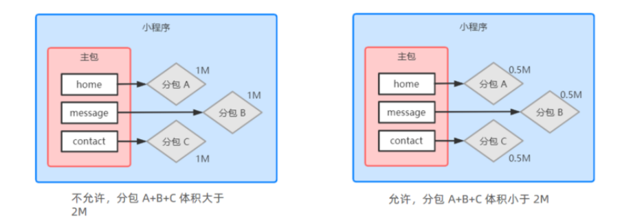

# 小程序-05

## 一、使用 npm 包

### 1.1、小程序对 npm 的支持与限制

目前，小程序中已经支持使用 npm 安装第三方包，从而来提高小程序的开发效率。 

但是，在小程序中使用 npm 包有如下 3 个限制： 

① 不支持依赖于 Node.js 内置库的包 

② 不支持依赖于浏览器内置对象的包 

③ 不支持依赖于 C++ 插件的包 

总结：虽然 npm 上的包有千千万，但是能供小程序使用的包却“为数不多”。

### 1.2、API Promise 化

默认情况下，小程序官方提供的异步 API 都是基于回调函数实现的，例如，网络请求的 API 需要按照 如下的方式调用：

```
wx.request({
  method: '',
  url: '',
  data: {},
  success: () => {}, // 成功的回调
  complate: () => {}, // 无论成功与否都会执行的回调
  fail: () => {} // 失败的回调
})
```

这种代码的缺点是显而易见的, 容易造成回调地狱的问题，代码的可读性、维护性差！而我们就想将这 种类型的代码使用 API Promise 化进行改造

API Promise 化，指的是通过额外的配置，将官方提供的、基于回调函数的异步 API ，升级改造为基 于 Promise 的异步 API ，从而提高代码的可读性、维护性，避免回调地狱的问题。

### 1.3、实现 API Promise 化

在小程序中，实现 API Promise 化主要依赖于 miniprogram-api-promise 这个第三方的 npm 包。 

它的安装和使用步骤如下:

```bash
npm i --save miniprogram-api-promise

- 下载完成，我们不能直接使用，而是需要再次重新构建npm包
- 建议在构建前先删除原有的miniprogram_npm
- 然后再点击工具，构建npm
```

导入并执行代码

```js
// 在小程序入口文件中（app.js),只需要调用一次 promisifyAll()方法
// 即可实现异步API 的Promise化
// 按需导入一个方法
import {
  promisifyAll
} from 'miniprogram-api-promise'
// 声明一个常量，为一个空对象，
// 并在wx顶级对象下添加一个属性p也指向该空对象，使所有成员都可以使用该对象
const wxp = wx.p = {}
// promisify all wx's api
// 参数1： wx顶级对象
// 参数2： wxp指向一个空对象
promisifyAll(wx, wxp)
```

解释上述代码: 

- promisifyAll : 做的事就是将 wx 拥有的属性方法都copy并改造了一份给了 wxp 这个对象 
- 然而, wxp 只是当前 js 文件的一个常量，只能在当前文件使用 
- 因此：我们在 wx 上挂载一个属性 p 让他和 wxp 指向同一个空对象 
- 在其他页面或者组件就可以通过全局对象 wx 点出 p 来访问到 wxp 
- 此时 wx.p 发起异步的请求时，得到的是一个 promise 对象 
- 那么我们就可以使用 async/await 简化Promise语法

## 二、全局数据共享

全局数据共享（又叫做：状态管理）是为了解决组件之间数据共享的问题。

开发中常用的全局数据共享方案有： Vuex 、 Redux 、 MobX 等。

在小程序中，可使用 mobx-miniprogram 配合 mobx-miniprogram-bindings 实现全局数据共享。其 中：

- mobx-miniprogram 用来创建 Store 实例对象 
- mobx-miniprogram-bindings 用来把 Store 中的共享数据或方法，绑定到组件或页面中使用

### 2.1、MobX

```bash
npm init -y
npm install --save mobx-miniprogram mobx-miniprogram-bindings
```

这里用到了 mobx-miniprogram-bindings 模块，模块说明在这里：

https://developers.weixin.qq.com/miniprogram/dev/extended/functional/mobx.html 

npm 命令执行完后，记得在开发者工具的项目中点一下菜单栏中的 `工具` - `构建 npm` 。

在项目根目录下新建store文件夹，并且新建 store.js 文件

**如何使用参考这篇文章**：

https://developers.weixin.qq.com/community/develop/article/doc/0004686e3c8980b53469f176e51413

### 2.2、创建 MobX 的 Store 实例


在项目根目录下新建store文件夹，并且新建 store.js 文件

```js
// 按需导入第三方包的方法observable, action
import {
	observable,
	action
} from 'mobx-miniprogram'
// 创建 Store实例对象,并将其导出
export const store = observable({
	// 数据字段
	numA: 1,
	numB: 2,
	// 计算属性
	// 在计算属性的方法前，必须加 get修饰符，代表sum的值是只读的，无法进行修改
	// 计算属性sum 依赖于numA和numB的值，因此sum函数的返回值就是最终的值
	get sum() {
		return this.numA + this.numB
	},
	// 定义actions方法, 用来修改 store中的数据
	updateNum1: action(function (step) {
		this.numA += step
	}),
	updateNum2: action(function (step) {
		this.numB += step
	})
})
```


### 2.3、使用 Store 中的成员

在页面中使用

页面的 js 文件中

```js
// 1.首先 导入第三方包，将数据绑定到页面
import {
  createStoreBindings
} from 'mobx-miniprogram-bindings'
// 2.其次 在页面的js文件的头部区域导入容器的数据
import {
  store
} from '../../store/store'
// 3. 绑定操作：将仓库的东西绑定到当前的页面中，在页面的js文件的Page方法中
Page({
  // 上面周期函数--监听页面的加载
  onLoad: function () {
    // 调用createStoreBindings方法
    // 参数1： 绑定给谁：当前页面this
    // 参数2： 对象{ store(容器)， fields(数据)， actions(修改方法)
    this.storeBindings = createStoreBindings(this, {
      // 映射容器的实例
      store,
      // 映射容器的数据字段
      fields: ['numA', 'numB', 'sum'],
      // 映射容器修改的方法
      actions: ['updateNum1']
    })
  },
  // 生命周期函数--监听页面的卸载
  onUnload: function () {
    // 使用this.storeBindings，得到调用createStoreBindings方法的返回值
    //调用destroyStoreBindings 方法，进行清理销毁的工作
    this.storeBindings.destroyStoreBindings()
  },
  // 页面的js文件中的 tap事件处理函数
  btnHnadler1(e) {
    console.log(e)
    // 使用仓库中的方法，并传递数据
    this.updateNum1(100)
  }
})
```


页面的 wxml 文件中

```html
<!-- 使用仓库中的数据 -->
<view>{{numA}} + {{numB}} = {{sum}}</view>
<van-button type="primary" bindtap="btnHnadler1">numA+1</van-button>
```

### 2.4、在组件中使用

1. 新建组件文件夹以及组件文件 numbers 
2. 全局注册这个组件 
3. 在 message 页面中使用子组件

## 三、分包

### 3.1、分包概念

分包指的是把一个**完整的小程序项目**，按照需求**划分为不同的子包**，在**构建时打包成不同的分包**，**用户在使用时按需进行加载**。

分包的好处：

- 可以优化小程序首次启动的下载时间 
- 在多团队共同开发时可以更好的解耦协作

**分包前** 项目的构成

分包前，小程序项目中所有的页面和资源都被打包到了一起，导致整个项目体积过大，影响小程序首次 启动的下载时间。

**分包后** 项目的构成：

分包后，小程序项目由 **1个主包** + **多个分包**组成：

- **主包**：一般只包含项目的启动页面或 TabBar 页面、以及所有分包都需要用到的一些公共资源
- **分包**：只包含和当前分包有关的页面和私有资源


 分包的加载规则：

1. 在小程序启动时，默认会下载主包并启动主包内页面。tabBar 页面需要放到主包中
2. 当用户进入分包内某个页面时，客户端会把对应分包下载下来，下载完成后再进行展示。。非 tabBar 页面可以按照功能的不同，划分为不同的分包之后，进行按需下载

分包的体积限制：


目前，小程序分包的大小有以下两个限制：

- 整个小程序所有分包大小不超过 16M （主包 + 所有分包）
- 单个分包/主包大小不能超过 2M


### 3.2、使用分包

 配置方法：

在 app.json 配置文件中, 新增 subpackages 的节点, 将希望放到分包的页面,写入 subpackages 数组的 元素中.


打包原则：

1. 小程序会按 subpackages 的配置进行分包， subpackages 之外的目录将被打包到主包中
2. 主包也可以有自己的 pages （即最外层的 pages 字段）
3. tabBar 页面必须在主包内
4. 分包之间不能互相嵌套

引用原则：

1. 主包无法引用分包内的私有资源
2. 分包之间不能相互引用私有资源
3. 分包可以引用主包内的公共资源

### 3.3、独立分包

独立分包本质上也是分包，只不过它比较特殊，可以独立于主包和其他分包而单独运行。

独立分包和普通分包的区别:

最主要的区别：是否依赖于主包才能运行

- 普通分包必须依赖于主包才能运行 
- 独立分包可以在不下载主包的情况下，独立运行

独立分包的应用场景:

开发者可以按需，将某些具有一定功能独立性的页面配置到独立分包中。原因如下：

- 当小程序从普通的分包页面启动时，
- 需要首先下载主包 而独立分包不依赖主包即可运行，可以很大程度上提升分包页面的启动速度

> 注意：一个小程序中可以有多个独立分包。

和普通分包对比, 独立分包就是在 subpackages 数组的某个元素中, 配置 independent 为true即可


5. 引用原则:

独立分包和普通分包以及主包之间，是相互隔绝的，不能相互引用彼此的资源！例如：

1. 主包无法引用独立分包内的私有资源
2. 独立分包之间，不能相互引用私有资源 
3. 独立分包和普通分包之间，不能相互引用私有资源 
4. 特别注意：独立分包中不能引用主包内的公共资源


### 3.4、分包预下载

分包预下载指的是：在进入小程序的某个页面时，由框架自动预下载可能需要的分包，从而提升进入后 续分包页面时的启动速度。

配置分包的预下载：

预下载分包的行为，会在进入指定的页面时触发。在 app.json 中，使用 preloadRule 节点定义分包 的预下载规则，示例代码如下：

```json
"preloadRule": {
    // 触发分包预下载的页面路径
    "page/concact/concact": {
      // network 表示在指定的网络模式下进行预下载
      // 可选值有： all(不限网络)和wifi(仅 wifi 模式下进行预下载)
      // 默认值为： wifi
      "network": "all",
      // packages 表示进入页面后， 预下载哪些分包
      // 可以通过root 或name 指定预下载哪些分包
      "packages": ["pkgA"]
    }
  }
```

同一个分包中的页面享有共同的预下载大小限额 2M ，例如：



## 四、自定义 tabBar

三大步骤：

```json
"tabBar": {
	"custom": true,
}
```

2、在项目根目录下创建custom-tab-bar文件夹, 并创建index组件

新建Component，输入组件名比如 index，自动生成以下文件：

```
custom-tab-bar/index.js
custom-tab-bar/index.json
custom-tab-bar/index.wxml
custom-tab-bar/index.wxss

```

> 注意: 文件夹的名称和组件的名称都不能改

3、编写 tabBar 代码


