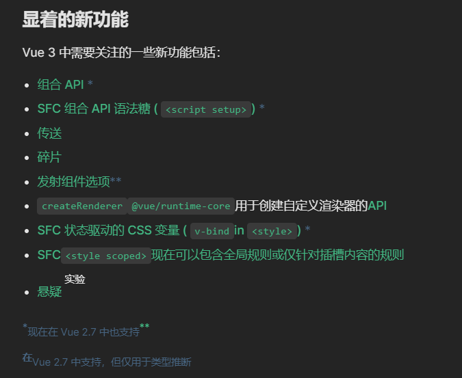
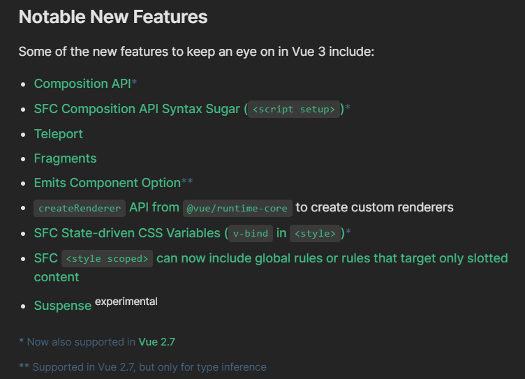
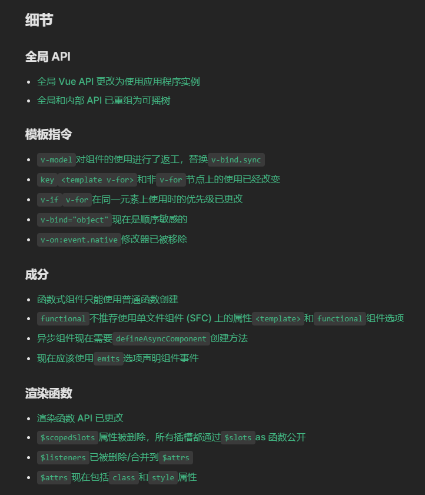
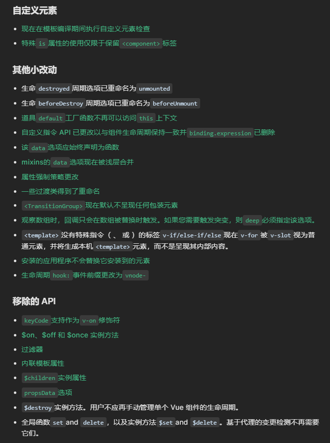

# 关于面试题

## 详解

### 1、遇到什么技术难点

自己看着办

### 2、做项目中有没有对性能方面针对优化

细节更多参考：https://www.yuque.com/cuggz/interview/lph6i8#a269103a206df0c6a836737ea6855851

1. CDN
2. 懒加载
3. 回流与重绘
4. 节流与防抖
5. 图片优化
6. webpack优化

### 3、缓存优化前缓存和线上缓存怎么处理?


### 4、浏览器请求一张图片返回成功了，第二次再请求返回的状态码是什么

### 5、登录模块的加密处理?

### 6、前端安全方面的策略和问题有没有了解

好长。。。。

参考文章：https://juejin.cn/post/7067697624626757646#comment

### 7、跨域有什么解决方案?(有两个域名A、B，登录域名A自动实现登录域名B，登录后可以共享localstorage里面的数据，有哪些方案)

俺不会

### 8、vue3 和 vue2 区别?vue3针对vue2做了哪些优化

#### 1. Vue3.0有什么更新

（1）**监测机制的改变**

- 3.0 将带来基于代理 Proxy的 observer 实现，提供全语言覆盖的反应性跟踪。
- 消除了 Vue 2 当中基于 Object.defineProperty 的实现所存在的很多限制：

只能监测属性，不能监测对象

- 检测属性的添加和删除；
- 检测数组索引和长度的变更；
- 支持 Map、Set、WeakMap 和 WeakSet。


（3）模板

- 作用域插槽，2.x 的机制导致作用域插槽变了，父组件会重新渲染，而 3.0 把作用域插槽改成了函数的方式，这样只会影响子组件的重新渲染，提升了渲染的性能。
- 同时，对于 render 函数的方面，vue3.0 也会进行一系列更改来方便习惯直接使用 api 来生成 vdom 。


（4）对象式的组件声明方式

- vue2.x 中的组件是通过声明的方式传入一系列 option，和 TypeScript 的结合需要通过一些装饰器的方式来做，虽然能实现功能，但是比较麻烦。
- 3.0 修改了组件的声明方式，改成了类式的写法，这样使得和 TypeScript 的结合变得很容易


（5）其它方面的更改

- 支持自定义渲染器，从而使得 weex 可以通过自定义渲染器的方式来扩展，而不是直接 fork 源码来改的方式。
- 支持 Fragment（多个根节点）和 Protal（在 dom 其他部分渲染组建内容）组件，针对一些特殊的场景做了处理。
- 基于 tree shaking 优化，提供了更多的内置功能。

#### 2. defineProperty和proxy的区别

Vue 在实例初始化时遍历 data 中的所有属性，并使用 Object.defineProperty 把这些属性全部转为 getter/setter。这样当追踪数据发生变化时，setter 会被自动调用。


Object.defineProperty 是 ES5 中一个无法 shim 的特性，这也就是 Vue 不支持 IE8 以及更低版本浏览器的原因。


但是这样做有以下问题：

1. 添加或删除对象的属性时，Vue 检测不到。因为添加或删除的对象没有在初始化进行响应式处理，只能通过`$set` 来调用`Object.defineProperty()`处理。
2. 无法监控到数组下标和长度的变化。


Vue3 使用 Proxy 来监控数据的变化。Proxy 是 ES6 中提供的功能，其作用为：用于定义基本操作的自定义行为（如属性查找，赋值，枚举，函数调用等）。相对于`Object.defineProperty()`，其有以下特点：

1. Proxy 直接代理整个对象而非对象属性，这样只需做一层代理就可以监听同级结构下的所有属性变化，包括新增属性和删除属性。
2. Proxy 可以监听数组的变化。

#### 3. Vue3.0 为什么要用 proxy？

在 Vue2 中， 0bject.defineProperty 会改变原始数据，而 Proxy 是创建对象的虚拟表示，并提供 set 、get 和 deleteProperty 等处理器，这些处理器可在访问或修改原始对象上的属性时进行拦截，有以下特点∶

- 不需用使用 `Vue.$set` 或 `Vue.$delete` 触发响应式。
- 全方位的数组变化检测，消除了Vue2 无效的边界情况。
- 支持 Map，Set，WeakMap 和 WeakSet。


 Proxy 实现的响应式原理与 Vue2的实现原理相同，实现方式大同小异∶ 

- get 收集依赖
- Set、delete 等触发依赖
- 对于集合类型，就是对集合对象的方法做一层包装：原方法执行后执行依赖相关的收集或触发逻辑。

#### 4.  Vue 3.0 中的 Vue Composition API？

在 Vue2 中，代码是 Options API 风格的，也就是通过填充 (option) data、methods、computed 等属性来完成一个 Vue 组件。这种风格使得 Vue 相对于 React极为容易上手，同时也造成了几个问题：

1. 由于 Options API 不够灵活的开发方式，使得Vue开发缺乏优雅的方法来在组件间共用代码。
2. Vue 组件过于依赖`this`上下文，Vue 背后的一些小技巧使得 Vue 组件的开发看起来与 JavaScript 的开发原则相悖，比如在`methods` 中的`this`竟然指向组件实例来不指向`methods`所在的对象。这也使得 TypeScript 在Vue2 中很不好用。


于是在 Vue3 中，舍弃了 Options API，转而投向 Composition API。Composition API本质上是将 Options API 背后的机制暴露给用户直接使用，这样用户就拥有了更多的灵活性，也使得 Vue3 更适合于 TypeScript 结合。


如下，是一个使用了 Vue Composition API 的 Vue3 组件：

```javascript
<template>
  <button @click="increment">
    Count: {{ count }}
  </button>
</template>
 
<script>
// Composition API 将组件属性暴露为函数，因此第一步是导入所需的函数
import { ref, computed, onMounted } from 'vue'
 
export default {
  setup() {
// 使用 ref 函数声明了称为 count 的响应属性，对应于Vue2中的data函数
    const count = ref(0)
 
// Vue2中需要在methods option中声明的函数，现在直接声明
    function increment() {
      count.value++
    }
 // 对应于Vue2中的mounted声明周期
    onMounted(() => console.log('component mounted!'))
 
    return {
      count,
      increment
    }
  }
}
</script>
```

显而易见，Vue Composition API 使得 Vue3 的开发风格更接近于原生 JavaScript，带给开发者更多地灵活性

#### 5. Composition API与React Hook很像，区别是什么

从React Hook的实现角度看，React Hook是根据useState调用的顺序来确定下一次重渲染时的state是来源于哪个useState，所以出现了以下限制

- 不能在循环、条件、嵌套函数中调用Hook
- 必须确保总是在你的React函数的顶层调用Hook
- useEffect、useMemo等函数必须手动确定依赖关系


而Composition API是基于Vue的响应式系统实现的，与React Hook的相比

- 声明在setup函数内，一次组件实例化只调用一次setup，而React Hook每次重渲染都需要调用Hook，使得React的GC比Vue更有压力，性能也相对于Vue来说也较慢
- Compositon API的调用不需要顾虑调用顺序，也可以在循环、条件、嵌套函数中使用
- 响应式系统自动实现了依赖收集，进而组件的部分的性能优化由Vue内部自己完成，而React Hook需要手动传入依赖，而且必须必须保证依赖的顺序，让useEffect、useMemo等函数正确的捕获依赖变量，否则会由于依赖不正确使得组件性能下降。

虽然Compositon API看起来比React Hook好用，但是其设计思想也是借鉴React Hook的。

更多参考 vue3 迁移指南：https://v3-migration.vuejs.org/

#### 显著的新功能：





重大变化：参考官网：https://v3-migration.vuejs.org/breaking-changes/





### 9、css样式优化? css权重和优先级

#### 优化:

[参考地址](https://zhuanlan.zhihu.com/p/474555164#:~:text=CSS%E6%80%A7%E8%83%BD%E4%BC%98%E5%8C%96%E7%9A%84%E6%96%B9%E5%BC%8F%E6%9C%89%E5%93%AA%E4%BA%9B%EF%BC%9F%201%201.%20%E7%B2%BE%E7%AE%80%E6%A0%B7%E5%BC%8F%E6%96%87%E4%BB%B6%202%202.%20%E5%88%A9%E7%94%A8%E7%BB%A7%E6%89%BF%E5%87%8F%E5%B0%91%E4%BB%A3%E7%A0%81%E9%87%8F%203,%E6%AD%A3%E7%A1%AE%E4%BD%BF%E7%94%A8%E9%80%89%E6%8B%A9%E5%99%A8%207%207.%20%E6%85%8E%E7%94%A8%E4%B8%80%E4%BA%9BCSS%E5%B1%9E%E6%80%A7%208%208.%20%E4%B8%8D%E8%A6%81%E4%BD%BF%E7%94%A8%40import%20%E6%9B%B4%E5%A4%9A%E9%A1%B9%E7%9B%AE)

1. 精简样式文件
2. 利用继承减少代码量
3. 内联首屏关键css
4. 异步加载css
5. 压缩文件
6. 正确使用 选择器
7. 慎用一些CSS属性
8. 不要使用 @import
9. 较少页面重排、重绘
10. 其他优化小点：
    - 慎重使用高性能属性：浮动、定位
    - 去除空规则：｛｝
    - 属性值为0时，不加单位
    - css雪碧图，同一页面相近部分的小图标
    - 将css文件放在页面最上面


| **选择器**     | **格式**      | **优先级权重** |
| -------------- | ------------- | -------------- |
| id选择器       | #id           | 100            |
| 类选择器       | .classname    | 10             |
| 属性选择器     | a[ref=“eee”]  | 10             |
| 伪类选择器     | li:last-child | 10             |
| 标签选择器     | div           | 1              |
| 伪元素选择器   | li:after      | 1              |
| 相邻兄弟选择器 | h1+p          | 0              |
| 子选择器       | ul>li         | 0              |
| 后代选择器     | li a          | 0              |
| 通配符选择器   | *             | 0              |

::: tip 注意 

- **!important声明的样式的优先级最高**；
- 如果优先级相同，则最后出现的样式生效；
- 继承得到的样式的优先级最低；
- 通用选择器（*）、子选择器（>）和相邻同胞选择器（+）并不在这四个等级中，所以它们的权值都为 0 ；
- 样式表的来源不同时，优先级顺序为：内联样式 > 内部样式 > 外部样式 > 浏览器用户自定义样式 > 浏览器默认样式。

:::


### 10、css 的link一种@import区别 

- link是XHTML标签，除了加载CSS外，还可以定义RSS等其他事务；**@import属于CSS范畴，只能加载CSS**。
- link引用CSS时，在页面载入时同时加载；**@import需要页面网页完全载入以后加载**。
- link是XHTML标签，**无兼容问题；@import是在CSS2.1提出的，低版本的浏览器不支持**。
- link支持使用Javascript控制DOM去改变样式；而@import不支持。


### 11、uni-app的onLoad和onShow的关系和执行顺序

onLoad:监听页面加载,一个页面只调用一次 ， 只加载一次

onShow:监听页面显示

#### 主要区别：

从二级页面返回该页面时，onLoad不会再次加载，而onshow会重新加载。

#### 总结：

- **onLoad先于onShow执行**
- onLoad页面的整个生命周期里，只执行一次
  -== onShow页面的整个生命周期里，可执行多次，即每次显示都会执行==
- 获取参数并且只请求一次的事件放在 onLoad 里。
- 当前页面需要时时刷数据的请求多次的事件放在 onShow 里。

### 12、vuex的工作流程

我感觉没固定答案 可以自己看着说

